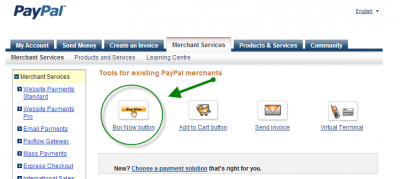
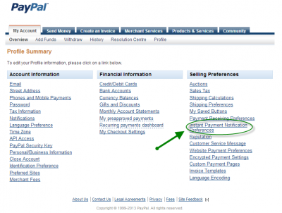
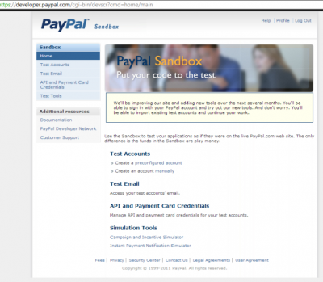

It's rare that I wrote something in PHP but since I have worked with Paypal with PHP in 2009, it will be simpler for me to show you how it works with this language. The same process can be apply for your .Net website. In fact, most steps are within Paypal website and interact with plain Html.

Paypal offers many ways to use their system for transaction. By memory, at least since 2009 x.com has become the reference website for Paypal. By then, they have developed rich API and documentation. Nevertheless, the IPN method, the one that I'll show you is simple and works since many years. From what I know, it's been over 6 years that this method is working (and could be more).

## Coding the button to send the Paypal's request

First of all, you need to have a Paypal account and create a **Merchant account**. You can get one for free, no need to have the "Premium Merchant" account. The Paypal account is required to receive the fund and the merchant account to be able to charge your customer. Second, you need to create a button that will redirect your user to Paypal with an amount to pay. You need to go to "Merchant Services" and create your button.

The method I am showing you has the limitation of having few hardcoded values like the price charged. You won't be able to change the amount directly via the Html Form. When creating the button, you'll have to set a fixed price. If you have, let say, three differents account, you may want to have 3 buttons generated with 3 hard coded amount. However, you can charge your customer which should be your main goal. Once the button is created, save the generated Html by Paypal to your webpage. Second, the button needs to be inside a form. This form will send the request to Paypal where the user will enter his Paypal's credential and to complete the order. Once the order is done, Paypal will send you back a message indicating that the transaction is a success or not. From here, you need to tell to Paypal what is the web page it needs to call. You have to go to "My Account" and then "Profile". You will see "Instant Payment Notification", click on it and write your "callback" webpage.

Third, you need to associate the user to the transaction because you want that in the call back to save into your database that you have a new transactions executed for a specific user. This can be done by adding hidden fields to the form where the Paypal's button has been inserted. In fact, you can go to the [IPN Guide](https://www.x.com/sites/default/files/ipnguide.pdf) or the [online documentation](https://www.x.com/developers/paypal/documentation-tools/paypal-payments-standard/integration-guide/Appx_websitestandard_htmlvariables#id08A6HF080O3) and see all possibles parameters (hidden fields) that can be sent to Paypal with a button. I use the "custom" field where I concatenate multiple information like the user id, the goods id, etc.

[php] <input type="hidden" name="custom" value="<?php echo(urlencode(base64\_encode($usagerCourant->getIdUsager()."+1")));?>"> <input type="hidden" name="lc" value="fr"/> [/php]

Has you can see in the example above, I am encoding the user id and I concatenate the item id. When Paypal will call back my webpage, I'll be able to get from the http header the field custom and decode the field to get back both information. You can also see that I am using the hidden field name "lc". This field tells Paypal to display itself in French. This can be useful if you have multiple languages to support.

Last thing concerning the button and the form: you need to send the request somewhere. You have two places where you can send the transction. The first is the real web site where real money is involved. The second is called "SandBox" where is a place to mess around. Everything inside the sandbox is fake, and won't be charged. You can do you test with the sandbox environment without having to refund real transaction. The two url are:

https://www.paypal.com/cgi-bin/webscr

https://www.sandbox.paypal.com/cgi-bin/webscr

## Creating the IPN's callback

From here, you need to write the call back page. This is where all the hard work is required.

The call back page is harder because the testing process is longuer even with Paypal callback. You'll also need to use to debug log file because you do not have any direct feedback of what is going on.

The first step is to send back to Paypal every parameters with the additionnal command called "cmd" and indicating that you are validating that is a real request from Paypal. This is a secure protection that assure that the request is not forged by a malicious user. Since Paypal should have create the request, this one will validate that all parameters that he just sent are valid.

So, your code should look like this one :

[php] $req = 'cmd=\_notify-validate'; foreach ($\_POST as $key => $value) { $value = urlencode(stripslashes($value)); $req .= "&$key=$value"; } [/php]

Then, we need to send the request. I use a socket connection to send a Http request. Many other ways could be used of course. [php] $header = "POST /cgi-bin/webscr HTTP/1.0\\r\\n"; $header .= "Content-Type: application/x-www-form-urlencoded\\r\\n"; $header .= "Content-Length: " . strlen($req) . "\\r\\n\\r\\n"; if($isDebugging) $fp = fsockopen('www.sandbox.paypal.com', 80, $errno, $errstr, 30); else $fp = fsockopen('ssl://www.paypal.com', 443, $errno, $errstr, 30); [/php]

Before sending back the request to Paypal, I personalty insert some information to my database concerning the transaction id, the item name, the user who bought the item/service the real name of the user and real email, etc. As you can see, I am not yet sending the request but preparing the socket to open an url (that change depending if I am testing or not). Since we are using at different place different url, I suggest that you have a mechanism to switch between dev/debug mode and prod/real mode. For more information concerning which url to use, please refer yourself to [this documentation](https://www.paypal.com/cgi-bin/webscr?cmd=p/sell/ipn-test-outside).

The next step is to send the request and wait the response.

[php] fputs ($fp, $header . $req); while (!feof($fp)) { $res = fgets ($fp, 1024); if (strcmp ($res, "VERIFIED") == 0) { //... //... } fclose ($fp); [/php]

If the answer is the string "VERIFIED" then everything is fine. From here, I do some other validation concerning if the price is right with the product/service bought and I can grand the user of his goods. For me, it's simply adding his id to a junction table with special privileges with an expiration date.

Paypal IPN service is fast and your user can be granted of what he bought immediately when you receive the request from the post back. This is a huge advantage because no manual intervention is required and the user can access everything right after he sent you the money.

## Testing with the sandbox

You can create fake customer with Paypal's Sandbox. Go to : [https://developer.paypal.com](https://developer.paypal.com). Once you have your developer account, which doesn't require you more than having a valid Paypal's account, you'll be able to create fake customer with fake email. This will allow you to use these fake Paypal account to do fake payment in the sandbox. It will also let you do fake refund. This is ideal to practice and to test your button, your post back page and how save into your database information about a transaction.

To test with the sandbox you absolytely need to create the button from the fake merchant account you have created in the sandbox. So once you have created a merchant account, log to https://www.sandbox.paypal.com/ and recreate the button.

## Watch out about fraud

Paypal is well know to protect the buyer more than the seller. Once, I have live a situation that he user pay and within the 30 days of refund, the user requested a refund. Even more, the user called his credit card company which created a fee of few dollar on me. In that case, if you provide premium service, it will be very hard to prove that you really provided this service. Trust me, Paypal won't fight for you. This is really sad because if you have downloadable content, and the user download everything and then request for refund, you will lose. The best way to organize your premium service is something that require to user to access only from your website and never more then few months (ideally recurrent payment every month).

Here is a [great source for Paypal and PHP](https://www.x.com/developers/paypal/documentation-tools/ipn/gs_IPN).

https://www.x.com/developers/paypal/documentation-tools/ipn/integration-guide/IPNIntro http://demos.ipn-easy.com/Howto/TestEnvironment.aspx
