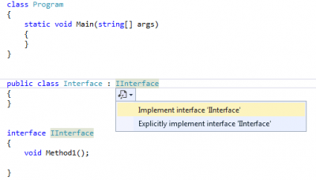

What is the difference between implicit and explicit interface?



Implicit interface allow access the the method without having to cast the object to the interface type while explicit interface require you to cast your object to the interface. Why would you want to have explicit interface? Because if you have several method from different interface with the same signature, the only way to call the good method is to do it explicitly.

Here is an example of an implicit interface: 
```csharp
 public class Interface : IInterface { public void Method1() { throw new NotImplementedException(); } } 
```

Here is an example of an explicit interface: 
```csharp
 public class Interface : IInterface { public void IInterface.Method1() { throw new NotImplementedException(); } } 
```

And you can use both in the same time: 
```csharp
 public class Interface : IInterface { void Method1() { throw new NotImplementedException(); }

void IInterface.Method1() { throw new NotImplementedException(); } } 
```

Let examine the following code :


```csharp
 class Program { static void Main(string[] args) { var x = new Interface(); x.Method1(); Console.ReadLine(); } }

public class Interface : IInterface, IInterfaceWithSameMethodSignature { public void Method1() { Console.WriteLine("IInterface:Method1 Implicit"); }

void IInterface.Method1() { Console.WriteLine("IInterface:Method1"); }

void IInterfaceWithSameMethodSignature.Method1() { Console.WriteLine("IInterfaceWithSameMethodSignature:Method1"); } }

interface IInterface { void Method1(); } interface IInterfaceWithSameMethodSignature { void Method1(); } 
```

As you can see, the Main method has a variable named 'x'. If we check the IntelliSence we see only the first Method1() of the Interface class. The reason is that we pass through the implicit method. If we want to use the explicit Method of the IInterface we need to cast 'x'. 
```csharp
 Interface x = new Interface(); x.Method1(); //Implicit prints: "IInterface:Method1 Implicit" ((IInterface)x).Method1(); //Explicit 1 prints: "IInterface:Method1" ((IInterfaceWithSameMethodSignature)x).Method1(); //Explicit 2 prints: "IInterfaceWithSameMethodSignature:Method1" 
```

This is handy because it disambiguates which methods to be called. This can be handy if the object is passed to a method that require the interface in a parameter. This one is cast when passed by parameters.


```csharp
 class Program { static void Main(string[] args) { var x = new Interface(); Method(x);

Console.ReadLine(); }

static void Method(IInterfaceWithSameMethodSignature expl) { expl.Method1(); } } 
``` The Interface class is used with the x object. This one is passed to a method that require the interface _IInterfaceWithSameMethodSignature_. When Method1 is called, the one of _IInterfaceWithSameMethodSignature_ is called, the explicit method.
