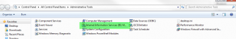
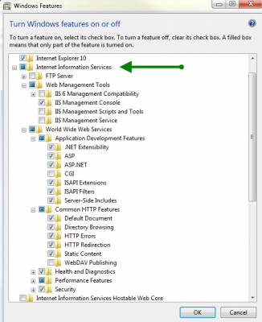
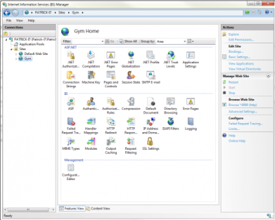
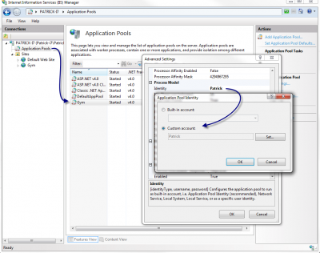
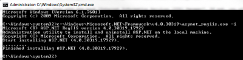
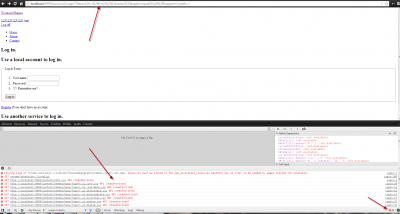
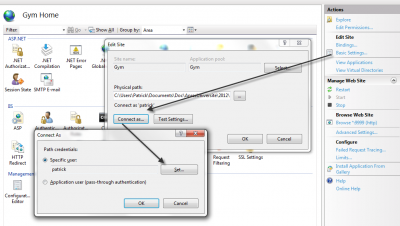

If you go to the administrator panel, you may not see IIS anywhere. To make sure, go to Control Panel\\All Control Panel Items\\Administrative Tools\\

If you have IIS, you will see an icon with the text "Internet Information Services (IIS) Manager". If not, you will have to install it, which is already part of Windows 7, it's just not enabled. To install it, go to Control Panel\\All Control Panel Items\\ and select Programs and Features. In the left side bar, you will see a link called "Turn Windows features on or off". Select this open.

You have to select IIS and go into subfolder to select what you see in the following image.

This will take several minutes depending of your machine. When everything is done, the control panel will now have in the administrative tools IIS.

So far, you have IIS, but you doesn't have your website linked to it. If you are a developer, the best way to make it works is to link IIS to the path where your code reside. I prefer not having my code in My Document because it will cause some security problem with default configuration. In fact, the user on which IIS will run the application pool won't have access to your file inside your My Document. Nevertheless, we can run IIS with an application pool that use your credential. First, open IIS and create a new website to which you will select the root of your web application (where the solution is). Be sure to have the website running on the good framework. I have found that it select framework 2.0 by default which should be the latest framework (4.0) if you run a MVC website. If you are using code inside your My Document, you also need to set your application pool to your account.

Now, if you try to run your website, you should be able to see it. If you get this message :

> IIS - this configuration section cannot be used at this path

It means that you haven't select every options in the image above when installing IIS. The good new is that it's not too late. You need to go back into the Windows Features and select the Application Development Features. If you get the error message : HTTP Error 500.19 - Internal Server Error - The requested page cannot be accessed because the related configuration data for the page is invalid. This mean that IIS doesn't have access to the folder. This mean that you need to change the Identity of the application pool as instructed before.

An other point of failure may be that IIS is not running with all the new installed configuration. You can know this if you get the message :

> Handler “ExtensionlessUrlHandler-Integrated-4.0” has a bad module “ManagedPipelineHandler” in its module list

To have IIS uses all new modules, open a Console as an administrator and execute the following line: c:\\Windows\\Microsoft.NET\\Framework\\v4.0.30319\\aspnet\_regiis.exe -i

The last problem that may arrive is that you see your website but without Javascript and CSS loading. You can notify this not only because your website won't display correctly but also because Javascript and CSS errors will be marked in every browser tools.

To fix this, two things must be set. First, you have the have the Static Content to be installed. This has to be checked when installing IIS. If not, you can go in Control Panel\\All Control Panel Items\\ and select Programs and Features. In the left side bar, you will see a link called "Turn Windows features on or off" and under Commont Http function of IIS you will see the option.

Second, you need to execute not only the application pool under your credential but also the set the authentification of the website under yours. To do it, select Basic Settings > Connect as... > Specific user.

From here, your website should work and from any location (even your My Document folder).
