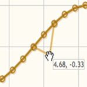

[JQPlot](http://www.jqplot.com) is a javascript library that make easy to have graphic on your website. By default, it uses all the power of Html5.



If you want to use JQPlot with Internet Explorer 8, add this line before adding the JQPlot's javascript files. 

``` html
 <!--[if IE]><script language="javascript" type="text/javascript" src="@Url.Content("~/Scripts/libs/plot/excanvas.js")"></script><![endif]--> 
```  
This Javascript library can be found on [Google Project](https://code.google.com/p/explorercanvas).

This will let the library use the [excanvas.js](https://code.google.com/p/explorercanvas) instead of the Html5 one.
