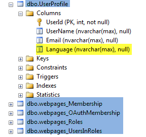

I am using since few months in most of my project the **SimpleMembershipProvider** instead of the old **SqlMembershipProvider**. SqlMembershipProvider is there for over 10 years and since Asp.Net MVC4, a new mechanism is available. This new provider comes by default with new Asp.Net MVC project and use the reference : WebMatrix.WebData.

The main goal of this new library is to simplify the use of user-password application. It also gives the possibility to extend more how to store the information. Sql Server is still behind but you can now use easily Azure storage if desired. It also simplify by a lot the number of tables and views requires in the past by SqlMembershipProvider. Now, the tables are limited to only few and you can customize their schema, the name of the tables and also fields names.



As you can see in the image above, you can add a Language field. This require only to add a property and let Entity Framework handle the rest. 
```csharp
 [Table("UserProfile")] public class UserProfile : ICurrentUser { public UserProfile() { this.UserName = "Anonymous"; this.Language = "en-US"; }

[Key] [DatabaseGenerated(DatabaseGeneratedOption.Identity)] public int UserId { get; set; }

public string UserName { get; set; }

public string Email { get; set; }

public string Language { get; set; } } 
```

If you are using Entity Framework with the migration tool, you just need to add in your seed method a one liner.


```csharp
 WebSecurity.InitializeDatabaseConnection( "DefaultConnection", "UserProfile", "UserId", "UserName", autoCreateTables: true); 
```

The first parameter is the Entity Framework connection string to your database, the second is the table name for the user then the column id for the user following by the name that is required when we logon.

If you need to have default role and user in your seed you can add them by using the Api.


```csharp
 protected override void Seed(DatabaseContext context) { base.Seed(context);

WebSecurity.InitializeDatabaseConnection( "DefaultConnection", "UserProfile", "UserId", "UserName", autoCreateTables: true);

if (!Roles.RoleExists(Model.Roles.ADMINISTRATOR)) Roles.CreateRole(Model.Roles.ADMINISTRATOR);

if (!Roles.RoleExists(Model.Roles.NORMAL)) Roles.CreateRole(Model.Roles.NORMAL);

if (!WebSecurity.UserExists("123123")) WebSecurity.CreateUserAndAccount("123123", "123123", new { Email="123123@123.com", Language="fr-CA"}); if (!WebSecurity.UserExists("qweqwe")) WebSecurity.CreateUserAndAccount("qweqwe", "qweqwe", new { Email = "qweqwe@qwe.com", Language = "en-US" });

if (!((IList<string>)Roles.GetRolesForUser("123123")).Contains(Model.Roles.ADMINISTRATOR)) Roles.AddUsersToRoles(new[] { "123123", "qweqwe" }, new[] { Model.Roles.ADMINISTRATOR }); if (!((IList<string>)Roles.GetRolesForUser("qweqwe")).Contains(Model.Roles.NORMAL)) Roles.AddUsersToRoles(new[] { "qweqwe" }, new[] { Model.Roles.NORMAL }); } 
```

I suggest you to read further on [Jon Galloway blog article](http://weblogs.asp.net/jgalloway/archive/2012/08/29/simplemembership-membership-providers-universal-providers-and-the-new-asp-net-4-5-web-forms-and-asp-net-mvc-4-templates.aspx).
