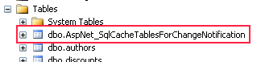

SQL Server since few years (2005) can push notifications when data has changed. The notification of this push use the Sql Cache Dependency. Before, the SQL Cacche Dependency has to continually poll the database, now, it's really push. To make it works, SQL Server you must enable Microsoft SQL Server Service Broker.

Once everything is installed property (Sql Server), you must enable your database to works with a service broker.


```sql
 ALTER DATABASE YourDatabase SET ENABLE\_BROKER GO 
```


By doing this SQL statement, you may have error like this one : "error 9772: The Service Broker in database 'YourDatabase' cannot be enabled because there is already an enabled Service Broker with the same ID". If this happen, just execute : 
```sql
 ALTER DATABASE YourDatabase SET ENABLE\_BROKER WITH ROLLBACK IMMEDIATE GO ALTER DATABASE YourDatabase SET NEW\_BROKER GO 
```


Next move is to enable notification with IIS.


```sql
 GRANT SUBSCRIBE QUERY NOTIFICATIONS TO "TESTSERVER\\ASPNET" 
```


The next step is within the code. You need to setup the notification to listen the database. This can be set in the global.asax


```csharp
 SqlDependency.Start(ConfigurationManager.ConnectionStrings["yourConnectionString"].ConnectionString); 
```

You can also make it stop.


```csharp
 SqlDependency.Stop(ConfigurationManager.ConnectionStrings["yourConnectionString"].ConnectionString); 
```

In both case, this should be setup once for your application. Here is an example.


```csharp


string tableName = "YourTable"; string connectionString = "..."; var result = HttpContext.Current.Cache[tableName] as List<T>;

if (result == null) { using (var cn = new SqlConnection(connectionString)) { cn.Open(); var cmd = new SqlCommand("SELECT \* FROM ...", cn); cmd.Notification = null; cmd.NotificationAutoEnlist = true; SqlCacheDependencyAdmin.EnableNotifications(connectionString); if (!SqlCacheDependencyAdmin.GetTablesEnabledForNotifications(connectionString).Contains(tableName)) { SqlCacheDependencyAdmin.EnableTableForNotifications(connectionString, tableName); }

var dependency = new SqlCacheDependency(cmd); SqlDataReader reader = command.ExecuteReader(); try { while (reader.Read()) { // Load the list into result } } finally { // Always call Close when done reading. reader.Close(); }

HttpContext.Current.Cache.Insert(tableName, result, dependency); } } 
```

As you can see, it checks if the table exist. If not, it creates a table called AspNet\_SqlCacheTablesForNotification where every table name will have a row. If a value change, the entry in this table will be removed.



This is quite interesting for distributed scenario where multiple source can change the value. The SQL Server act as a gateway where reside the information if the data is cached or not.

To conclude, we have seen that we can use the SqlCacheDependencyAdmin to enable the notification and also to create the table. We have seen that we can use the SqlCacheDependency with the cache to synchronize data between the database and the caching system. When the database chance, the cache will be flushed.

## If your notification is not trigged

I suggest that you search for a table called sys.transmission\_queue in your database. Your notification should be stored here but was not delivered. The cause can be a lot of thing but you should try to verify if you are allowed to create the table by code which require to be able to use the EXECUTE statement.
