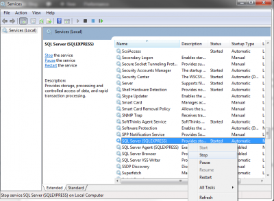
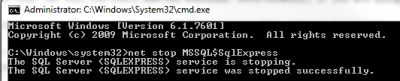

It's always a good idea to be able to see what's happening behind when you are using ORM, like Entity Framework. If you have the possibility to have the full blow Sql Server with tools, than you have the Sql Profiler that can tell you every queries executed. Unfortunately, if you are using the Sql Express Edition, you won't have the Sql Profiler available.

However, you still can get thoses queries outputted into a log file with the Sql Express edition. First of all, be sure to stop the SQL Express Service. This can be done by going into the Services.msc

Or you can use the command prompt with the command "net stop" with the parameter of the service which should be "MSSQL$SqlExpress". Of course, this must be done with the administrator privileges which can be

> net start MSSQL$SQLEXPRESS /T4032

The last thing to do is open the Sql Server Management Studio and to execute the following command.

> dbcc traceon(3605, -1)

From here, you just need to consult the log file. With Sql Server 2012 Express edition on a Windows 7 OS, you will find the log file here:

> C:\\Program Files\\Microsoft SQL Server\\MSSQL11.SQLEXPRESS\\MSSQL\\Log
