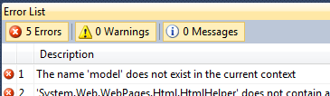

**The name 'model' does not exist in current context**. This is the error you can get in a view if you create the first view of an area. How come the framework do not understand the command @model? Well, every area must have a web.config that will contains the code that will tell .Net to use the Razor syntax, which contain the model.




```xml
 <system.web.webPages.razor> <host factoryType="System.Web.Mvc.MvcWebRazorHostFactory, System.Web.Mvc, Version=3.0.0.0, Culture=neutral, PublicKeyToken=31BF3856AD364E35" /> <pages pageBaseType="System.Web.Mvc.WebViewPage"> <namespaces> <add namespace="System.Web.Mvc" /> <add namespace="System.Web.Mvc.Ajax" /> <add namespace="System.Web.Mvc.Html" /> <add namespace="System.Web.Routing" /> </namespaces> </pages> </system.web.webPages.razor> 
```
 This error is often present when the area has been created by using "New Folder" instead of "New Area". Nevertheless, it's quite simple to solve with the web.config inside the folder.
