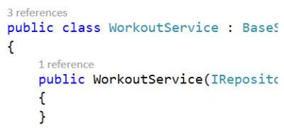
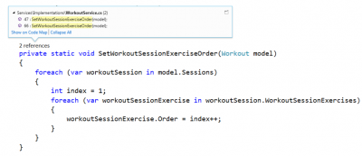
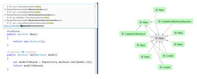
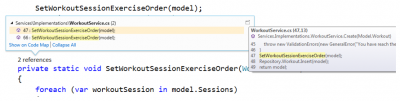
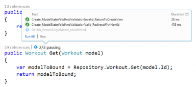

CodeLens is a new feature that enhance your code by adding additional information over yours methods. CodeLens add information concerning references, unit testing and TFS. We won’t talk about TFS in this article but concentrate on the two first features that is available even if you do not use TFS. Before anything, CodeLens is available only with Visual Studio 2013 Ultimate.

The first information CodeLens add over your method signature is the number of reference that the method does has. References are all codes entries that your code contain to the method where the information is added. If you are using ReSharper, you may find it similar to “Find Usage” feature but with the advantage of being dynamically available for all your method directly in Visual Studio. Visual Studio add this information directly above the method which allow to be very rapid to figure out if the method is used and where the method is called. To see it in action, open Visual Studio 2013 Ultimate Edition and select any of your existing project. The reference count will be written in small gray letter above each classes and each methods. 

To be able to get additional information concerning reference, pressing ALT+2 or clicking on the numbers of reference open a contextual window with all calls occurrences. You can from there select a reference to be transported directly to the file and line that call the method. 

It also possible from the same menu to generate the Code Map of the method. This is an interesting way to see all references links. 

If you do not want to move to the usage of your method because you just want to have a look but not to move from where you are, you can. To see the code that use it, you can have a small snapshot of 2 lines before and 2 lines after the call by moving the focus on a reference without clicking. 

The second information that is added by CodeLens is the number of unit test that is successful for the method compared to the number of total unit test. This is one of the greatest features to improve your code quality because in a single look, you can see if a method is tested or not. You can also visualize which test is in error or have passed. Within a single click, you can move from your method to your test. Another information that is provided is the amount of time the test took. This is a new metric used by executing unit testing and it allows you to improve your code by having near of each code the time that it takes to execute it.

As you can see, Visual Studio 2013 improves the integration of good software development by having near of your hand different information. Reference is a key information to have and unit testing help you and your team to work toward the objective to have a code quality better.
