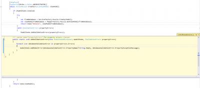
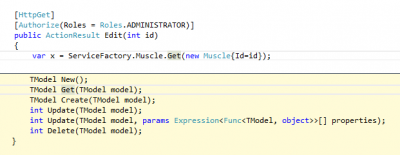

Visual Studio 2013 brings many new improvements and one of this one is the peak definition feature. This feature is available by the default shortcut alt+F12 when the caret of your mouse is on a method.

The goal of the peak definition is to display the content of the method inside the file, where the method is called. A picture worth a thousand words, so here is an example. I have clicked the AddValidationErrors and I have pressed `alt+F12`. What happen, is that a block with the title "controllersextension.cs" appears. It displays the code that would been called. You can close this window any time by clicking the "X" or by pressing escape.

The goal of this feature is to limit the number of file open for just watching what's happening. It's very fast, and allow to have a peak of what's happening. The only limit this new tool has is that it doesn't work well when the method is from an interface. In that case, you see the interface definition.

