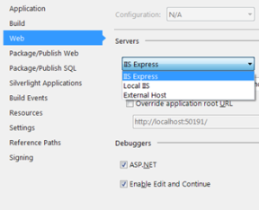

I have been developed with Visual Studio since the 2003 version and most of the time directly by executing the code with the default server which is the one that Visual Studio trig when you press F5 (Build and Execute). More and more, I had to use IIS because that bigger website (enterprise application) require a lot of IIS features which is more convenient than IIS Express or Cassini (the Development Server integrated with Visual Studio).

Since Visual Studio 2013, Cassini is gone. The default choice is IIS Express. You can change it to IIS or any external host.

This is a feature that I'll miss because small project was easy to execute with just Visual Studio. IIS Express is fine but the lack of visual help to configure make it good for people who is familiar with IIS setting. Cassini was removing this learning curl. Nevertheless, it makes developers know more about IIS and possibly create better application because developers will understand the whole picture.
