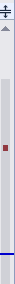
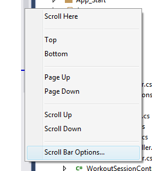
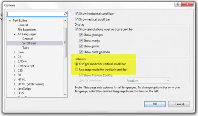
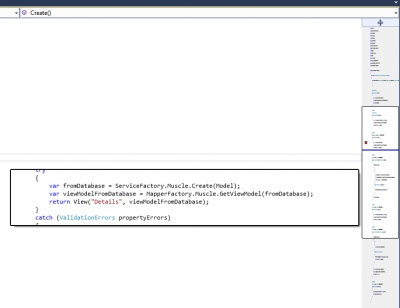

Visual Studio 2013 let you have two type of scroll bar. The first one is the same at in Visual Studio 2012 which contain additional information like where errors are located with a red rectangle and allow you to mark every keyword searched with a yellow mark. It also contain a dark brown color for break point and a blue line for the current line. The last thing it can display is what has changed.

Now, you can switch to have a visual representation of the code. This new scroll bar visualization is called the map mode.

To activate the map mode, right click on any scroll bar and select the options entry in the context menu.

This will bring the options menu for the scroll bar. At the right of the dialog window, a behavior frame contains the two available options.

Not only you can see the code but you can also if you put you mouse over the scroll bar see what the code is.

The main goal of this new feature is to allow you to move less when developing. It allows developer to not move back and forth inside a page. With the combination of the peak definition feature, the focus remains more and more into the task and not to move around files and lines.
