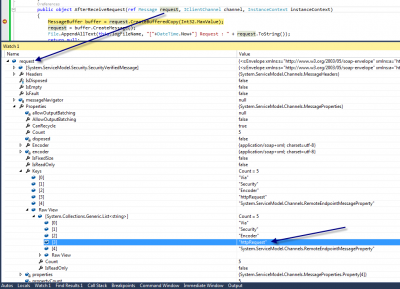

We have already talk about how to log every call of your WCF service with a [custom factory for all your WCF service](http://patrickdesjardins.com/blog/how-to-use-log-every-call-of-your-wcf-services-methods). This is a good way to log or to verify access to all your service methods. The main point was to create a factory which is called every calls it's done. Once it generated, it creates a new service behavior to which it needs to have a new operation behavior and invoker.

This time, the solution to log every method call it is by using inspector. An inspector is a filter that is executed before and after a request is executed. First of all, this solution works by configuring in the web.config a behavior. An entry to system.serviceModel > extensions > behaviorExtensions needs to be added and will be used to system.serviceModel > endpointBehaviors > behavior.

Here is an example of the web.config:


```xml
 <system.serviceModel> <extensions> <behaviorExtensions> <add name="myLogBehavior" type="MyServiceA.LogFileBehaviorExtensionElement, MyServiceA" /> </behaviorExtensions> </extensions> ... <services> <service name="MyServiceA.Service1"> <endpoint address="" behaviorConfiguration="behavior1" binding="wsHttpBinding" bindingConfiguration="" contract="MyServiceA.IService1" /> </service> </services> <behaviors> <endpointBehaviors> <behavior name="behavior1"> <myLogBehavior logFileName="c:\\log.txt" /> </behavior> </endpointBehaviors>

... 
```


Three parts are important. The first one is the extension that define the behavior extension. This allow us to create configuration outside the code that is defined inside the web.config. A name is specify that is referred later inside the web.config, and the second attribute is the name of the extension inside the code. In the example above, the code display a LogFileBehaviorExtensionElement that is inside the MyServiceA namespace. The second part is the service's endpoint itself. This is where we specify the contract, the binding and also the behaviorConfiguration. This behavior configuration lead us to the third important part which is the behavior that we have created. The third part is the endpointBehaviors where it specify the behavior. In the example, it's named "behavior1" which is referenced inside the endpoint. Inside this third part, the myLogBehavior define a parameter where it's the file log name.

The next step is to create the behavior extension element inside the code. 
```csharp
 /// <summary> /// Allow to join the end point behavior via web.config + parameter for the web.config /// </summary> public class LogFileBehaviorExtensionElement : BehaviorExtensionElement { [ConfigurationProperty("logFileName")] public string LogFileName { get { return (string)base["logFileName"]; } set { base["logFileName"] = value; } }

protected override object CreateBehavior() { return new LogOutputBehavior(this.LogFileName); }

public override Type BehaviorType { get { return typeof(LogOutputBehavior); } } } 
```

As you can see, this contain a configuration property which is the attribute of the file name defined in the web.config. It also create the behavior. The next class to create is the endpoint behavior. This is where we add the inspector to the endpoint. This mean that every method of the service will have the inspector hooked to them. If it's not the desired behavior, it's also possible to hook an inspector with a custom attribute.


```csharp
 /// <summary> /// Allow to hook an inspector /// </summary> public class LogOutputBehavior : IEndpointBehavior { private string logFileName; public LogOutputBehavior(string logFileName) { this.logFileName = logFileName; }

public void AddBindingParameters(ServiceEndpoint endpoint, BindingParameterCollection bindingParameters) { }

public void ApplyClientBehavior(ServiceEndpoint endpoint, ClientRuntime clientRuntime) { }

public void ApplyDispatchBehavior(ServiceEndpoint endpoint, EndpointDispatcher endpointDispatcher) { LogOutputMessageInspector inspector = new LogOutputMessageInspector(this.logFileName); endpointDispatcher.DispatchRuntime.MessageInspectors.Add(inspector); }

public void Validate(ServiceEndpoint endpoint) { } } 
```

The behavior create the inspector.


```csharp
 /// <summary> /// The inspector /// </summary> public class LogOutputMessageInspector : IDispatchMessageInspector { private string logFileName; public LogOutputMessageInspector(string logFileName) { this.logFileName = logFileName; } public object AfterReceiveRequest(ref Message request, IClientChannel channel, InstanceContext instanceContext) { MessageBuffer buffer = request.CreateBufferedCopy(Int32.MaxValue); request = buffer.CreateMessage(); File.AppendAllText(this.logFileName, "["+DateTime.Now+"] Request : " + request.ToString()); return null; } public void BeforeSendReply(ref Message reply, object correlationState) { MessageBuffer buffer = reply.CreateBufferedCopy(Int32.MaxValue); reply = buffer.CreateMessage(); File.AppendAllText(this.logFileName, "[" + DateTime.Now + "] Reply : " + reply.ToString()); }

} 
```

This is the inspector! We have the AfterReceiveRequest, that is called just before the method of the controller in entered and the BeforeSendReply that is called after the method is called. This Allow you to create an entry in the log and to know the starting and ending time of the call. You can also have access to the message sent. This is in soap format. Here is an example:


```xml
 [2013-11-09 14:21:01] Reply : <s:Envelope xmlns:a="http://www.w3.org/2005/08/addressing" xmlns:s="http://www.w3.org/2003/05/soap-envelope"> <s:Header> <a:Action s:mustUnderstand="1">http://tempuri.org/IService1/GetDataResponse</a:Action> <a:RelatesTo>urn:uuid:af68f512-6948-4c2f-b0a8-36cbd9799ebf</a:RelatesTo> </s:Header> <s:Body> <GetDataResponse xmlns="http://tempuri.org/"> <GetDataResult>You entered: 0</GetDataResult> </GetDataResponse> </s:Body> </s:Envelope> 
```


You have all the information you want. In real, you would like to parse this xml to get the method name which is inside the envelope>header>action or by using the Message property Headers and use the Action property to get the method called. It's also possible to get HttpRequest information is the endpoint is an http one.



This is it for WCF inspector.
