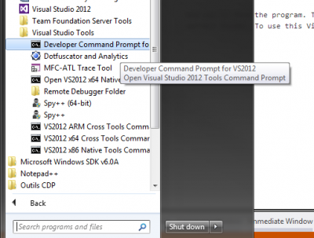
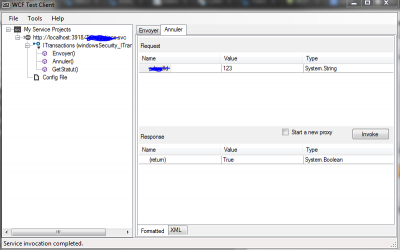

When you are consuming a web service, either if you are creating it and you want to debug this one or just to do a quick use of a service, Visual Studio comes with an external tool that can help you invoke methods of service.

This tool is called `WcfTestClient` and can be executed from the Developer Console.

Inside the console you doesn't need to insert any parameter (but you could set the url of the service).

From here, inside the menu you can add services with a complete url to the webservice. Once it's added, you will get all methods that can be invoked.

That's about it. From here you can invoke methods by setting parameters (if those aren't complex object) and see results.
