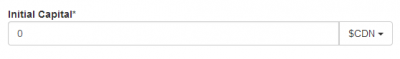
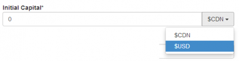

If you are developing an application that require to have money, they are big change that this money must be in a currency. So, every time you have to select a money, you have to select the currency too. A design pattern is to have a class that represent the money instead of using a decimal directly.

For example.


```csharp
 public class Contest { public Money InitialCapital { get; set; } }

public class Money { public Money() { Currency = CurrencyType.Canada; }

public decimal Value { get; set; } public int CurrencyTypeId { get { return this.Currency.Id; } set { this.Currency = CurrencyType.GetFromId(value); } } /// <summary> /// This is ignored by EntityFramework /// </summary> public CurrencyType Currency { get; set; } } 
```

This code use the pattern **Value Object** for all currencies. This is why it has additional code that you may not need. In fact, what is important is the the Money class has the money itself inside the Value property and then the currency inside CurrencyType property.

From there, you have the **View Model** that is different. This is a good example of why having a view model is important. The view model will have the whole list of existing and possible currency that the user can choose from. This is not the type of information that you should have in your model since the model should represent the reality. The view model should look this way:


```csharp
 public class ContestViewModel { [UIHint("SelectorForMoneyViewModel")] public SelectorForMoneyViewModel InitialCapital { get; set; } } 
```

The SelectorForMoneyViewModel is a simple class that has the Money and the list of available currencies.


```csharp
 public class SelectorForMoneyViewModel { public MoneyViewModel Current { get; set; }

public List<SelectorItem> AvailableCurrencies { get; set; }

public SelectorForMoneyViewModel() { this.Current = new MoneyViewModel(); this.AvailableCurrencies = new List<SelectorItem>(); } } 
``` From there, the **Editor Template** can use this list and put the whole list into the currency drop down. The result should look like the following picture. The first image is the control when not open and the second picture when the user click the currency field.





This is possible with the use of **BootStrap** but can be reproduced without it. I am using BootStrap because because it is available by default with Asp.Net MVC since version 5.


```csharp
 @model ViewModel.Selectors.Implementations.Money.SelectorForMoneyViewModel

<div class="input-group"> @Html.EditorFor(viewModel => viewModel.Current.Value) @Html.HiddenFor(viewModel => viewModel.Current.Currency.Id) <div class="input-group-btn"> <button type="button" class="btn btn-default dropdown-toggle" data-toggle="dropdown">@Model.Current.Currency.DisplayText<span class="caret"></span></button> <ul class="dropdown-menu pull-right"> @foreach (var currency in Model.AvailableCurrencies) { <li><a href="#" data-id="@currency.Id">@currency.DisplayText</a></li> } </ul> </div><!-- /btn-group --> </div><!-- /input-group --> 
``` First of all, we need to setup an hidden field to set the value of the selected currency. This would require some JavaScript to set from the the dropdown value into the hidden field that will be sent to the server. The first EditorFirst is important because it shows the value. The rest of the code is the drop down that is set at the right of the textbox of the decimal value.

Here is the Javascript that must be used for every pages that has the component.


```javascript


//For each link that is inside a FORM when used as DropDown-Menu Item we want to be able //to click an element and set this one as the visual one. We also set the value of the selected //item into the hidden field of the selected dropdown to have this value pushed to the server. $('form').on('click', '.dropdown-menu>li>a', function () { return dropdownMenuLinkAction($(this)); } );

//@description: Dropdown menu for a choice //@param link: a link that must be under the dropdown-menu function dropdownMenuLinkAction(link) { //Current link information var htmlLink = $(link); var clickedId = htmlLink.attr('data-id'); var clickedDisplayName = htmlLink.html(); var controlContainer = htmlLink.closest('.input-group'); //Change the hidden field (should only have one) controlContainer.find(':hidden').each( function () { $(this).val(clickedId); } ); //Change the visual of the dropdown (should only have one) controlContainer.find('.dropdown-toggle').each( function () { var htmlDropDown = $(this); var currentFullHtml = htmlDropDown.html(); var toRemove = htmlDropDown.text(); var toWriteBack = currentFullHtml.replace(toRemove, ""); htmlDropDown.html(clickedDisplayName + " " + toWriteBack); } ); $(this).dropdown("toggle"); //Close the menu once clicked return false; } 
``` 
 It attaches to every form that has a dropdown an action that is linked into each link of the drop down. This action takes the information set into the html attribute data-id to be able to move it into the html hidden field. The second part is to update the dropdown label to display the selected currency to the control when this one is closed.
