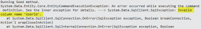

If you are using the new Asp.Net Identity framework which is working with OWIN, you may fall with a SQL exception. This exception look like this :

> System.Data.SqlClient.SqlException: Invalid column name 'UserId'



The UserId is a column that is ignored in the configuration of the entity. Why does it try to read from it?

Here is how the DbContext looks like: 
```csharp
 public class Configuration : DbMigrationsConfiguration<DatabaseContext> { public Configuration() { }

protected override void Seed(DatabaseContext context) { var userStore = new UserStore<ApplicationUser>(); var manager = new UserManager<ApplicationUser>(userStore);

var role = new IdentityUserRole { Role = new IdentityRole(Model.Roles.ADMINISTRATOR) }; var user = new ApplicationUser() { UserName = "123123", Email = "123123@123.com", Language = "en-US" }; user.Roles.Add(role); IdentityResult result = manager.Create(user, "123123");

var role2 = new IdentityUserRole { Role = new IdentityRole(Model.Roles.NORMAL) }; var user2 = new ApplicationUser() { UserName = "qweqwe", Email = "qweqwe@qweqwe.com", Language = "fr-CA" }; user.Roles.Add(role2); IdentityResult result2 = manager.Create(user2, "qweqwe"); //... } } 
```

The problem reside on the first line of the seeding method. The UserStore takes in its first parameter the database context. Since I am not explicitly telling the UserStore to take the one passed by parameter, it does not know about the configuration defined in the DatabaseContext.

To solve the problem just change the first line with this line:


```csharp
 var userStore = new UserStore<ApplicationUser>(context); 
```
