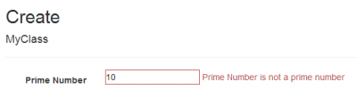
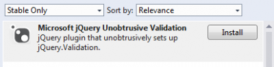

Asp.Net MVC Data Annotation is a powerful way to have business logic reusable over all your project. Some exist by default in the **System.ComponentModel.DataAnnotations** namespace. Among the most used Data Annotation is the Required and StringLength attribute.

Data Annotation is used by Asp.Net MVC **Data Binder** that convert Html input value back into your model. During this process, it calls every validations from Data Annotation. In fact, it use the **IValidatableObject** interface that you can even have your model inherit to have validation inside a method if you want.

At some point, you may have some validation that are repeated across multiple classes. This is the case for required field. Instead of validating with a IF statement in the Validate method provided by IValidatableObject or to have your setter check of the value of the property, an alternative is the Data Annotation. It has the advantage to be productive for you because you just need to add the attribute over the property and the validation is done. It can also be unit tested once and you can be sure that for every properties that use it that it is executed. Another point for Data Annotation is the possibility to have easily the Javascript doing the same thing for you. This mean that with a single Data Annotation you can have client side and server side validation.

Before going any further in the theory, let's create a small project with a simple model class the custom Data Annotation is used.


```csharp
 public class MyClass { [PrimeNumberOnly] [Display(Name = "Prime Number")] public int PrimeNumber { get; set; } public DateTime StartDate { get; set; } public DateTime EndDate { get; set; } } 
```

This is the model class. I have created the PrimeNumberOnly attribut which is my custom Data Annotation. I used the Display attribute because will use this instead of the property name in the custom Data Annotation for error. But, this is not required. If it is not declared, the property name is used.

The controller is very simple. It checks for the ModelState to see if it has error, if yes, it displays back the form otherwise it redirects to the list of my class. 
```csharp
 [HttpPost] public ActionResult Create(MyClass myClass) { if (ModelState.IsValid) { return RedirectToAction("Index"); } else { return View(); } } 
```

Here come what is interesting, the custom Data Annotation.


```csharp
 public class PrimeNumberOnly : ValidationAttribute { protected override ValidationResult IsValid(object value, ValidationContext validationContext) { if (value != null) { int valueInteger; if (int.TryParse(value.ToString(), out valueInteger)) { if (IsPrime(valueInteger)) { return ValidationResult.Success; } else { return new ValidationResult(string.Concat(validationContext.DisplayName, " is not a prime number")); } } else { return new ValidationResult(string.Concat(validationContext.DisplayName, " must be an integer")); } } return ValidationResult.Success; }

private bool IsPrime(int number) { //... } } 
```

The first thing we can notice is the inheritance of the class. It inherits from ValidationAttribute. This is the base class for Data Annotation attribute. It is totally perfect to inherit from an existing Data Annotation like the Required attribute if what you are doing enhance an existing Data Annotation. Therefore, it is not our case since we want to block non-prime number.

This interface lets override a method named **IsValid** that take two parameters. The first one is the value non-typed. The second is information about the context. The property name, the instance of the the class being validated is also available and the pretty name too (the one that use the display attribute). The IsValid must return Validation.Success if everything is fine. However, if something is wrong, it must return a **ValidationResult** object. The ValidationResult accepts a message that will be used by Asp.Net MVC to acknowledge. It is also possible to mark not only the property that is being tested but to mark other properties of the class with ValidationResult with the same error.



If you want to pass the ErrorMessage to the attribute, you can. By default, it use the the FormatErrorMessage method that takes the property name. So, if you pass a custom error with a {0} the parameter is substitute. In the code above, the property display name is used and replaced in the error message. 
```csharp
 return new ValidationResult(base.FormatErrorMessage(validationContext.DisplayName)) 
```

If you want to add the member name you have to supply a second parameter. 
```csharp
 return new ValidationResultbase.FormatErrorMessage(validationContext.DisplayName,new []{ validationContext.MemberName})) 
```

In the case you want to have multiple parameters like having numbers or property names to shows, it is possible to combine resource files and formatting. To do, do not use FormatErrorMessage but use the ErrorMessageString and do by yourself the formatting.


```csharp
 return new ValidationResult(string.Format(this.ErrorMessageString,"One", "Two", DateToBeAfter), new[] { validationContext.MemberName); 
```

So far, half of the job is done because if we erase the number and type a valid entry, the error will not go away before the form is submitted again. This is normal, we have coded only the server side aspect of the Data Annotation. A second interface is required to be inherited to have client side validation. This time, it is named **IClientValidatable**. This interface come from the System.Web.Mvc interface. This mean that if you are using View Model, do not inherit the model from this attribute but the view model. Otherwise, you are mixing back end classes and front end classes. For the purpose of this exercise, I am mapping directly the model class to the view, which mean that it is acceptable to have my model class inherit of System.Web.Mvc.IClientValidatable. Please, do not copy and paste that if you are developing serious application.

The IClientValidatable interface comes with the **GetClientValidationRules** method. This give us the possibility to extend the html generated for property. When Asp.Net MVC generates the input, it can add additional data- tag. These tag are required for the client side. They are called unobtrusive since it adds information to the Html input without attaching the Javascript. This mean that we have a third step to do which will be to tell Javascript to use those added attribute. But first, why adding data- to our Html input that has the custom Data Annotation? It is required for several reasons. First, if the logic is in error, we need an error message. It cannot be hard coded into the Javascript because this message can be localized. Adding a data- tag with the error message gives you the possibility to get the message and to expose it to your user if the error occurs. Second, you can add additional information to the Html input by attribute like value to be used in the Javascript validation. Here is an example.


```csharp
 public class PrimeNumberOnly : ValidationAttribute, IClientValidatable { protected override ValidationResult IsValid(object value, ValidationContext validationContext) { //... }

private bool IsPrime(int number) {

//... }

public IEnumerable<ModelClientValidationRule> GetClientValidationRules(ModelMetadata metadata, ControllerContext context) { var rule = new ModelClientValidationRule { ValidationType = "primenumber", ErrorMessage = FormatErrorMessage(metadata.GetDisplayName()), };

//This is not required. For the purpose of showing how to pass information to the Javascript I will set two values. rule.ValidationParameters.Add("primenumberparam1", "Value1"); rule.ValidationParameters.Add("primenumberparam2", "Value2");

yield return rule; } } 
```

In the example above, we are setting a single rule with a validation message (the ErrorMessage) that is set to the _data-val-primenumber_. I also added two lines that add validation parameters. In a real situation, this can be dynamic value to be checked during the Javascript method that will validate the input. For checking if a number is a prime number, no parameter is required.

Keep in mind that you cannot use capital letter in the ValidationType or you will have a yellow screen of the death with this message:

> Validation type names in unobtrusive client validation rules must consist of only lowercase letters. Invalid name: "primeNumber", client rule type: System.Web.Mvc.ModelClientValidationRule This generate this Html output:

The result of the Html is :

```html
<div class="col-md-10"> <input class="text-box single-line" data-val="true" data-val-number="The field Prime Number must be a number." data-val-primenumber="The field Prime Number is invalid." data-val-primenumber-primenumberparam1="Value1" data-val-primenumber-primenumberparam2="Value2" data-val-required="The Prime Number field is required." id="PrimeNumber" name="PrimeNumber" type="number" value=""> <span class="field-validation-valid" data-valmsg-for="PrimeNumber" data-valmsg-replace="true"> </span> </div> 
``` 

This need also to have some libraries installed and referenced in your Html page.


```html  
<script src="~/Scripts/jquery.validate.js"></script> <script src="~/Scripts/jquery.validate.unobtrusive.js"></script> <script src="~/Scripts/PrimeNumberOnlyValidation.js"></script> 
``` 

You may need to add with NuGet the unobstructive.js. 

The validate.js must be before the unobstructive.js file.

The PrimeNumberOnlyValidation.js file contains the validation in Javascript. It is required to be configured once than you just need to have the script added to your file. Here is the complete file:

```typescript
$.validator.addMethod("primenumber", function (value, element, params) { if (value) { if (value == 1) return false; if (value == 2) return false;

for (var i = 3; i < value; i = i + 2) { if (value % i == 0) return false; } } return true; });

$.validator.unobtrusive.adapters.add('primenumber' , ['primenumberparam1', 'primenumberparam2'] , function (options) { options.rules["primenumber"] = { primenumberparam1: options.params.primenumberparam1, primenumberparam2: options.params.primenumberparam2 }; options.messages["primenumber"] = options.message; } ); 
``` 


The first statement register the method to be called when the validation is trigged. It is the same algorithm to check prime number in Javascript than in C#. If it return false, then the error message specified in the C# code is shown. This is possible because the error message is inside the data tag of the input. The tag is "data-val-primenumber". The second adds an adapter to JQuery validator. The first parameter is the name of the validator. It is the same name than the method. Then, you specify the parameter set in C#. Finally, a anonymous function let you transfert the value of each parameters from C# to the JQuery validation plugin. It does the hook between the html attribute data- generated from C# to Javascript.

### Conclusion

If you are getting problem with the plugin, verify that you have all Javascript loaded in the good sequence. To test the plugin, you have to hit the button save. By default, JQuery Validator does not validate on blur but when the form is submitted. Finally, you can get the whole project code in [GitHub](https://github.com/MrDesjardins/TestingDataAnnotationProject).
