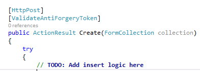

Cross Site Request Forgeries is also know as CSRF. It is a type of malicious exploit that send commands from a user without his consent to another website. CSRF exploits the trust that a site has in a user's browser. 
For example, a website could try to execute a form to add something in your Amazon basket! This can be limited by adding an hidden field to a form and a cookie. Both will contain the same value and when the form is submitted the hidden field is compared to the cookie value. If it's the same value, we know that the user has sent the form. If it's not, we know it's a malicious attack.

In Asp.Net MVC, ValidateAntiForgeryToken is a combination of an html helper (hidden field) and attribute(cookie) that allows to verify if the form as been created and sent by the same user.

The first step is to add the HtmlHelper method @Html.AntiForgeryToken() inside the form in your view.

```csharp
@using (Html.BeginForm()) { @Html.AntiForgeryToken() //... 
```

This generate an hidden field with the name `__RequestVerificationToken` and an unique value. This is an example of the output generated:


```html  
<form action="/House/Create" method="post" novalidate="novalidate"> 
  <input name="__RequestVerificationToken" type="hidden" value="KPyzBk0KGpjStJR96AVI38AbBujBInJNB-1XH-RwsbuifwgmxnGiF-0R2cMHjcYBiz7yOBUnv0fZwoE2oBwiuKXalBDvsRr2RRG7nmkOsq41"> 
``` 

The code behind the html helper is simple. It creates a MvcHtmlString from the AntiForgery class.


```csharp
public MvcHtmlString AntiForgeryToken() { 
  return new MvcHtmlString(AntiForgery.GetHtml().ToString()); 
} 
```

The `AntiForgery` class contains the `GetHtml()` used in the html helper but also some validation of the forgery. Both use the class `AntiForgeryWorker`.


```csharp
public static HtmlString GetHtml() { 
  if (HttpContext.Current == null) 
    throw new ArgumentException(WebPageResources.HttpContextUnavailable); 
  else 
    return AntiForgery._worker.GetFormInputElement((HttpContextBase) new HttpContextWrapper(HttpContext.Current)).ToHtmlString(TagRenderMode.SelfClosing); 
} 
```

The worker that we see in the code above is of type `AntiForgeryWorker`. This class is about 139 lines and the core of it is the `GetFormInputElement` used by the `GetHtml`.


```csharp
 public TagBuilder GetFormInputElement(HttpContextBase httpContext) { 
  this.CheckSSLConfig(httpContext); 
  AntiForgeryToken cookieTokenNoThrow = this.GetCookieTokenNoThrow(httpContext); 
  AntiForgeryToken newCookieToken; 
  AntiForgeryToken formToken; 
  this.GetTokens(httpContext, cookieTokenNoThrow, out newCookieToken, out formToken); 
  if (newCookieToken != null) 
    this._tokenStore.SaveCookieToken(httpContext, newCookieToken); 
  if (!this._config.SuppressXFrameOptionsHeader) 
    httpContext.Response.AddHeader("X-Frame-Options", "SAMEORIGIN"); 
  TagBuilder tagBuilder = new TagBuilder("input"); 
  tagBuilder.Attributes["type"] = "hidden"; 
  tagBuilder.Attributes["name"] = this._config.FormFieldName; 
  tagBuilder.Attributes["value"] = this._serializer.Serialize(formToken); 
  return tagBuilder; } 
```

This is interesting to see how the value is generated. As we can see, it's using the serializer to serialize the form token. The form token is build inside the class TokenValidator that take some property of the Identity. I won't go deeper because it goes a little beyond the scope of the article. Just remember that the token is unique for the user. However, the GetFormInputElement code above is also important for something else. The token store role is to create the cookie which set also the token.


```csharp
public void SaveCookieToken(HttpContextBase httpContext, AntiForgeryToken token) { 
  HttpCookie cookie = new HttpCookie(this._config.CookieName, this._serializer.Serialize(token)) { 
    HttpOnly = true 
  }; 
  if (this._config.RequireSSL) 
    cookie.Secure = true;
  httpContext.Response.Cookies.Set(cookie); 
} 
```

The way the `ValidateAntiForgeryToken` attribute works is by checking to see that the cookie and hidden form field left by the `Html.AntiForgeryToken()` Html Helper essentially exists and match. If they do not exist or match, it throws an `HttpAntiForgeryException`.



The attribute does have a `ValidateAntiForgeryTokenAttribute` method that call the `AntiForgery` class. I have previously mentioned that it has not only the method to get the input but also for validation. Here is where it's used.


```csharp
 public ValidateAntiForgeryTokenAttribute() : this(new Action(AntiForgery.Validate)) { } 
```

This method go through several method of the framework to end to the `ValidateTokens(...)` methods that look like the code below. 
```csharp
public void ValidateTokens(HttpContextBase httpContext, IIdentity identity, AntiForgeryToken sessionToken, AntiForgeryToken fieldToken) { 
  if (sessionToken == null) 
    throw HttpAntiForgeryException.CreateCookieMissingException(this._config.CookieName); 
  if (fieldToken == null) throw HttpAntiForgeryException.CreateFormFieldMissingException(this._config.FormFieldName); 
  if (!sessionToken.IsSessionToken || fieldToken.IsSessionToken) 
    throw HttpAntiForgeryException.CreateTokensSwappedException(this._config.CookieName, this._config.FormFieldName); 
  if (!object.Equals((object) sessionToken.SecurityToken, (object) fieldToken.SecurityToken)) 
    throw HttpAntiForgeryException.CreateSecurityTokenMismatchException(); 
    string str = string.Empty; 
    BinaryBlob binaryBlob = (BinaryBlob) null; 
    if (identity != null && identity.IsAuthenticated) { 
      binaryBlob = this._claimUidExtractor.ExtractClaimUid(identity); 
      if (binaryBlob == null) 
        str = identity.Name ?? string.Empty; 
    } 
    bool flag = str.StartsWith("http://", StringComparison.OrdinalIgnoreCase) || str.StartsWith("https://", StringComparison.OrdinalIgnoreCase); 
    
    if (!string.Equals(fieldToken.Username, str, flag ? StringComparison.Ordinal : StringComparison.OrdinalIgnoreCase)) 
      throw HttpAntiForgeryException.CreateUsernameMismatchException(fieldToken.Username, str); 
    if (!object.Equals((object) fieldToken.ClaimUid, (object) binaryBlob)) 
      throw HttpAntiForgeryException.CreateClaimUidMismatchException(); 
    if (this._config.AdditionalDataProvider != null && !this._config.AdditionalDataProvider.ValidateAdditionalData(httpContext, fieldToken.AdditionalData)) 
      throw HttpAntiForgeryException.CreateAdditionalDataCheckFailedException(); 
} 
```

What interest us is all possible exception that are throws. You can see that is can raise HttpAntiForgeryException for several case like if the cookie is missing, which is the case for Cross Site Request Forgeries or if the form doesn't have the hidden field, or if the token mismatch between the cookie and the form.

All the complexity of the mechanism is hidden by the Asp.Net MVC framework. At the end, you only need to remember to add the html helper to your form and to add the attribute to the action of your controller that receive the form inputs.
