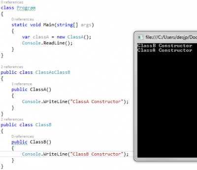
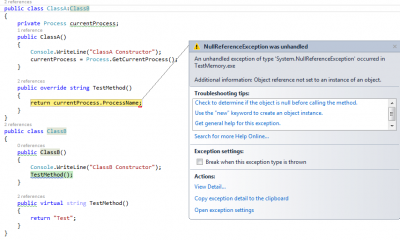

Instantiating an object calls obviously the controller of the class. In the case that the class inherit from a second class, the base constructor is called before the code inside the derived class. This can be shown very easily by printing to the console every times the constructor is called. 

```csharp
 class Program { static void Main(string[] args) { var classA = new ClassA(); Console.ReadLine(); } }

public class ClassA:ClassB { public ClassA() { Console.WriteLine("ClassA Constructor"); } } public class ClassB { public ClassB() { Console.WriteLine("ClassB Constructor"); } } 
``` 



Having a method virtual allow the derived class to override the method. If the base class call the method, this one call, if overrided, call the one in the derived class. This mean that if you are instantiating value in the derived class that this one will not have the data instantiated yet. This can produce unexpected error like having null reference or working with a set of data that is not initialized with the desired value. The problem is that in the life time of the class, this one could be inherited which create new unexpected scenarios of where the virtual method is defined.

We can transform the previous code into this scenario. For example, let's create a new virtual method where we return a string. In the derived class, we will return the name of the current process. In the base class, we return a simple string. The derived class must instantiated the Process object to get information about the current process. This has been instantiated in the constructor. Since it will be called after that the base constructor is done with its initialization and since the base constructor call the virtual method, this one will crash. The error occurs because the base class call the method that is overrided. The override is executed. It uses a variable that is not yet instanciated.


```csharp
 public class ClassA:ClassB { private Process currentProcess; public ClassA() { Console.WriteLine("ClassA Constructor"); currentProcess = Process.GetCurrentProcess(); }

public override string TestMethod() { return currentProcess.ProcessName; } } public class ClassB { public ClassB() { Console.WriteLine("ClassB Constructor"); TestMethod(); }

public virtual string TestMethod() { return "Test"; } } 
``` 

The result is that the TestMethod() from the base class call the TestMethod() of the derived class and crash at the currentProcess line.



A simple way to solve this issue is to seal the class, but on the other hand, limit the possibility of expending your class and force you to not have virtual method on this sealed class. Or, you can limit the calls of virtual method inside constructor.
