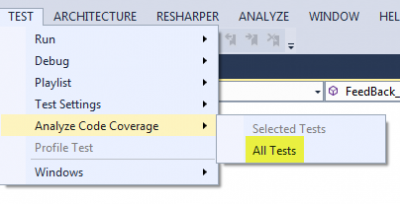
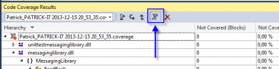
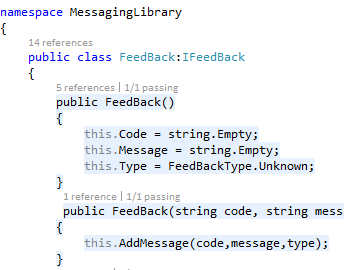

Microsoft Visual Studio has the ability to tell you what is covered by your unit test. Not all edition has this feature, but Premium and Ultimate do.

First of all, where is the code coverage tool in Visual Studio? It's in the **Test** menu under **Analyze Code Coverage**.

Once done, the Code Coverage Result panel open. You can open this panel by going to Test>Windows>Code Coverage Result if you want to open it later.

This panel indicates the number of code block and the percentage covered by all code. As you can see, event the unit test project is in the statistic (red arrow). What is important is the blue arrow, the project tested. As you can see in the image below, every thing is unit tested (100%). 

Another feature is to display directly into the code which line has been hit and which one has not been hit. Visual Studio and code coverage tool can highlight in green all code that has been reach by unit tests and in red if no test has executed the line. To enable this feature, click on the Code Coverage Result the icon with multiple block. 

Once clicked, you will see the code changing.

I have entitled this post with Visual Studio 2013 but in fact, this is available since 2008 without much change. It's not well known but very interesting if you are using unit testing.
