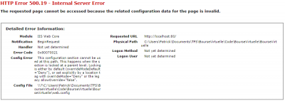
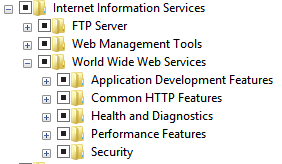

Developing with IIS Express has its limitation. More you are developing and more you may have several website, web api, WCF and others system that must run together. You can increase your compilation process by only compiling and publishing the system that has changed. Visual Studio is bright enough to not recompile every libraries but it also has it pitfalls with IIS Express that suddenly have some of its references not synchronize. The result is obvious. First of all, the "start up" project will work but some of the others will not. For example, if you have a web project and a web api with the web as a startup project, you may have the web working when the web api will result to any types of error possibles.

A solution is to use IIS instead of IIS Express. This way, every compilation, only the libraries that has changed are compiled but once it is compiled, all your system will stay in a working stage (indeed it must have been in a working stage). To switch is pretty easy. Open IIS and create one website for your web project and so on. Define different ports for all your website and that's it. Not so fast! You can have a error 500:

> This configuration section cannot be used at this path. This happens when the section is locked at a parent level. Locking is either by default.

This error occurs if you have not added some of IIS features. To add those features, open the Windows Feature by typing "Turn Windows features on or off" in the start menu. This open a window with some Windows feature. Select "Internet Information Services", "World Wide Web Services" and all of them.

From there, be sure that your web application in IIS point to the web project and the other one to the web api project. Not the DLL folder, but the folder where the project is located. You just need to compile and you are up and running. If you need to debug with break point, you need to go in Visual Studio and go to Debug > Attach To Process. Click "Show Process from all user" and select the w3wp.exe process. Click attach and you are ready to debug.
