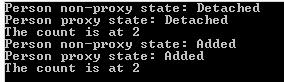

Creating a new instance and having Entity Framework handling this one in its context require some manipulations. You have two different paths to accomplish this goal. The first one is to create the entity and to add them to the DbSet. The second one is to create the instance from the DbSet directly instead of instantiated this one with **new** keyword. Here is a code that add two entities. One that is not tracked by Entity Framework and when that it is because it has been created with the **Create** method.


```csharp
 using (var context = new YourContext()) { // Create a new instance with Add var person = new Person {Name = "New person with New Keyword",BirthDate = DateTime.Now}; Console.WriteLine("Person non-proxy state: " + context.Entry(person).State); context.Persons.Add(person);// Now Entity Framework added the object but was not tracking anything

// Create a new instance with Entity Framework (proxy) var person2 = context.Persons.Create(); Console.WriteLine("Person proxy state: " + context.Entry(person2).State); person2.Name = "New Person from EF"; person2.BirthDate = DateTime.Now; context.Persons.Add(person2); // Still need to add but EF was tracking changes var x1 = context.Persons.Local.Count(); Console.WriteLine("The count is at " + x1);

// Detect Changes context.ChangeTracker.DetectChanges(); Console.WriteLine("Person non-proxy state: " + context.Entry(person).State); Console.WriteLine("Person proxy state: " + context.Entry(person2).State); var x2 = context.Persons.Local.Count(); Console.WriteLine("The count is at " + x2);

context.SaveChanges(); } 
```

The result is the same for those two creations because we do not use anything from the Entity Framework Proxy. Choosing from one or the other method to create is more a preference than a guidance. You have to choose which one you prefer and keep your whole system using the same. Otherwise, it will be confusing to know if we need to or not bound the entity to EF proxies.



You can get the source code on [GitHub](https://github.com/MrDesjardins/EntityFrameworkTestConsole/tree/57dd76464002943f8aa44d21f53b2c3197d47531) or download the [Zip file](https://github.com/MrDesjardins/EntityFrameworkTestConsole/archive/57dd76464002943f8aa44d21f53b2c3197d47531.zip).
