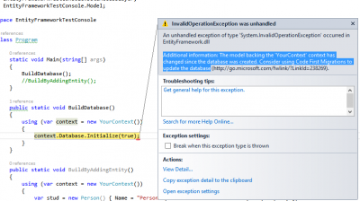
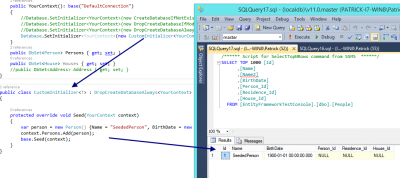

Initializing a database with Entity Framework is essential. It creates the database, tables and all constrains. In a previous article, we saw that is it possible to generate the database when the context specify to the database to initialize itself or when adding an entity to the database. However, when the database exist and that we have changed model classes, how can we control how the database schema is altering? This is the goal of this article. We will see how we can control Entity Framework to create and especially how to update database schema.

We have already see the `default initializer`. It is named `CreateDatabaseIfNotExists`. This is only interesting when you start a brand new application. The reason is that a small change like adding a new property to a class will throw an exception. The reason is that Entity Framework realize that the model from the code is not anymore synchronized with the table schema. This result to an `InvalidOperationException` that look like this:

> Additional information: The model backing the 'YourContext' context has changed since the database was created. Consider using Code First Migrations to update the database.



If you want to use that type of initializer, you have to manually delete the whole database for every modification of your context. For your information, the default intializer could also be explicitly specify in the contructor of your DbContext.


```csharp
 public YourContext(): base("DefaultConnection") { Database.SetInitializer<YourContext>(new CreateDatabaseIfNotExists<YourContext>()); //Default one } 
```

Instead of having to delete yourself every times the database, you can use the second initializer that will drop for you the database if any changes has been detected. This second initializer the drop the database for you is named `DropCreateDatabaseIfModelChanges`.


```csharp
 public YourContext(): base("DefaultConnection") { Database.SetInitializer<YourContext>(new DropCreateDatabaseIfModelChanges<YourContext>()); //Drop database if changes detected } 
```

It is important to note that this initializer will not delete the database if you do not change model. If you run your application multiple time, it could start to have a lot of data that you may not want. In the scenario you would prefer to erase every data of your database even if you do not change the model, than you have to use a third initializer. `DropCreateDatabaseAlways` drop the database every time the application start.


```csharp
 public YourContext(): base("DefaultConnection") { Database.SetInitializer<YourContext>(new DropCreateDatabaseAlways<YourContext>()); //Drop database every times } 
```

The problem with all these initializer is that all of them at some point let you down with default value. You have to have a SQL script to fill up tables with initial data. This is where the most useful initializer exist. It is the custom initializer. You can create you own initializer and inherit from one of the three we just discussed. For example, you can drop all the database every times the schema as changed which will create all tables but also in this custom initializer tell Entity Framework to insert default demo values. You can also create one that does not inherit any of the three but inherit from `IDatabaseInitializer`. The advantage of inheriting from an existing initializer is that you can use the leverage of basic functionnality and only override the Seed method to push data into the website.


```csharp
 public YourContext(): base("DefaultConnection") { Database.SetInitializer<YourContext>(new CustomInitializer<YourContext>()); //Custom if model changed and seed values } //... public class CustomInitializer<T> : DropCreateDatabaseIfModelChanges<YourContext> { protected override void Seed(YourContext context) { base.Seed(context); } } 
```

The CustomInitializer method override the Seed method. This is where you can use the context passed by parameter to insert data into your database. You do not have to call SaveChanges to save anything because the class that call the seed method call the `SaveChanges` right after calling the seeding method.



If the database already exist, you may stumble into the case of having an error. The exception "Cannot drop database because it is currently in use" can raise. This problem occurs when an active connection remains connected to the database that it is in the process of being deleting. A trick is to override the `InitializeDatabase` method and to alter the database. This tell the database to close all connection and if a transaction is open to rollback this one.


```csharp
public class CustomInitializer<T> : DropCreateDatabaseAlways<YourContext> { public override void InitializeDatabase(YourContext context) { context.Database.ExecuteSqlCommand(TransactionalBehavior.DoNotEnsureTransaction , string.Format("ALTER DATABASE {0} SET SINGLE_USER WITH ROLLBACK IMMEDIATE", context.Database.Connection.Database)); base.InitializeDatabase(context); }

protected override void Seed(YourContext context) { var person = new Person() {Name = "SeededPerson", BirthDate = new DateTime(1900, 1, 1)}; context.Persons.Add(person); base.Seed(context); } } 
```

The last configuration is to remove all initialization. This will not check if the database has changed, neither check if something is not synchronized between tables and model classes. This is perfect if you have an existing database that is not handled by Entity Framework for the creation and insertion of initial values.


```csharp
 public YourContext(): base("DefaultConnection") { Database.SetInitializer<YourContext>(null); //No initialization } 
```

Before concluding, I have to say that any of the initializer should have been set in the static constructor of your context. The static constructor is called before any constructors and is executed once. This is what we want. The reason is that in some of your application, you may initialize more than once the context. You do not want to execute all the process to check if the database if ready to be changed or not.


```csharp
 static YourContext() { //Database.SetInitializer<YourContext>(new CreateDatabaseIfNotExists<YourContext>()); //Default one //Database.SetInitializer<YourContext>(new DropCreateDatabaseIfModelChanges<YourContext>()); //Drop database if changes detected //Database.SetInitializer<YourContext>(new DropCreateDatabaseAlways<YourContext>()); //Drop database every times //Database.SetInitializer<YourContext>(new CustomInitializer<YourContext>()); //Custom if model changed and seed values Database.SetInitializer<YourContext>(null); //Nothing is done } 
```

We have see how to use Entity Framework to initialize a database but also how to seed it with testing values. We have see many different way to initialize the database, tables and model classes with Entity Framework. So far, we have not discussed about Entity Framework Migration Tool to initialize the database. This tool allow to have manual call to with Entity to the database to perform initialization. It has the advantage to have the full control of when and what is done but has the disadvantage to have more to do. Information about Migration tool will be discussed later. You can find all code discussed in this article at [GitHub](https://github.com/MrDesjardins/EntityFrameworkTestConsole/tree/dd74613a51e8533d833aac6706d6b067c859b7e0) or download the [Zip file here](https://github.com/MrDesjardins/EntityFrameworkTestConsole/archive/dd74613a51e8533d833aac6706d6b067c859b7e0.zip).
