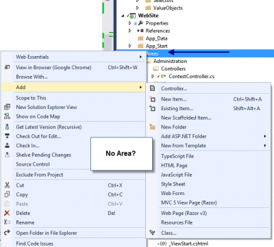
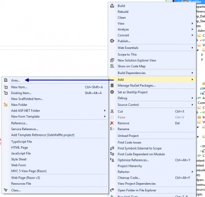

Adding an area can be done manually by adding a folder inside your Web Site project under the **Areas** folder. From there you can add a folder for your controller. However, a better way exist that create for your the area with all folders required. It also add the \_ViewStart.cshtml for you. If you right click the Areas folder you will not find anything related to **Add Area**.

Everything is hidden in the contextual menu of the website project. 

This will add for you your area. If not Areas folder exist, it will add it for your. It will also take care to register the area with the map route.
