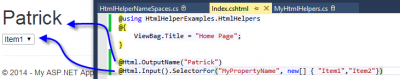

Html helper allows to have reusable code around your application about html creation. For example, the Html helper for a textbox create a Html Input of type text. It allows to set the name and the value from the model. Html helpers are a must to use with Asp.Net MVC.

At some point, custom helpers are required to be developed in house for specific needs. A simple approach is to simply create an extension method to the html helper. Here is a small example of creating an Html helper. The Html helper is an extension to the HtmlHelper class.


```csharp
 public static class MyHtmlHelpers { public static MvcHtmlString OutputName(this HtmlHelper helper, string name) { return new MvcHtmlString(string.Format("<h1>{0}</h1>",name)); } } 
```

This can be used into views this way:


```csharp
 @Html.OutputName("Patrick") 
```

The problem with this approach is that is become harder and harder with the time to know which Html Helper are from Asp.Net MVC and which ones is a custom ones. It become also cumbersome to not have namespace inside the helpers.

This problem converge us to this blog post, we will put all customs Html helper into a specific method inside the HtmlHelper. What we want is to create segmentation of all Html Helpers. The following code is the result of what we want to create. Inside the HtmlHelper class, we will inject method that will be our namespaces. We could set all our inputs controler into Input and divide with other "namespace" other Html input. To be short, we will create only the input one in this blog post and only for the creation of a select list. As you will see, we will create a non-generic Helper, like in the code below, but also the generic one. This will give us the possibility to use a lambda expression to specify which property to use instead of specifying it with a string.


```csharp
 @Html.Input().SelectorFor("MyPropertyName", new[] { "Item1","Item2"}) @Html.Image()... //And so on. 
```

First, we need to inject the method for our namespaces.


```csharp
 public static class HtmlHelperNameSpaces { public static HelperExtensionInputFactory Input(this HtmlHelper helper) { return new HelperExtensionInputFactory(helper); }

public static HelperExtensionInputFactory<TModel> Input<TModel>(this HtmlHelper<TModel> helper) { return new HelperExtensionInputFactory<TModel>(helper); } } 
```

In the code above, we see that we have two Input method. One takes an HtmlHelper and the other one HtmlHelper. We can have more method for more namespace. The same logic apply. We need to take the HtmlHelper as the first parameter to create the extension. Then, we need to return the Html Helper that has the code.


```csharp
 /// <summary> /// Generic /// </summary> public class HelperExtensionInputFactory<TModel> : HelperExtensionInputFactory { private HtmlHelper<TModel> HtmlHelper { get; set; }

public HelperExtensionInputFactory(HtmlHelper<TModel> htmlHelper) : base(htmlHelper) { HtmlHelper = htmlHelper; }

public MvcHtmlString SelectorFor<TValue>(Expression<Func<TModel, TValue>> property, IEnumerable<string> items) { var meta = ModelMetadata.FromLambdaExpression(property, this.HtmlHelper.ViewData); string fullPropertyName = HtmlHelper.ViewContext.ViewData.TemplateInfo.GetFullHtmlFieldName(ExpressionHelper.GetExpressionText(property));

var selectBuilder = new TagBuilder("select"); selectBuilder.MergeAttribute("name", fullPropertyName); selectBuilder.MergeAttribute("id", fullPropertyName); selectBuilder.MergeAttribute("class", "selector");

foreach (var item in items) { var optionBuilder = new TagBuilder("option"); optionBuilder.MergeAttribute("value", item); optionBuilder.SetInnerText(item); selectBuilder.InnerHtml += optionBuilder.ToString(); } return new MvcHtmlString(selectBuilder.ToString()); } }

/// <summary> /// Non-Generic /// </summary> public class HelperExtensionInputFactory { private HtmlHelper HtmlHelper { get; set; }

public HelperExtensionInputFactory(HtmlHelper htmlHelper) { this.HtmlHelper = htmlHelper; }

public MvcHtmlString SelectorFor(string fullPropertyName, IEnumerable<string> items) {

var selectBuilder = new TagBuilder("select"); selectBuilder.MergeAttribute("name", fullPropertyName); selectBuilder.MergeAttribute("id", fullPropertyName); selectBuilder.MergeAttribute("class", "selector");

foreach (var item in items) { var optionBuilder = new TagBuilder("option"); optionBuilder.MergeAttribute("value", item); optionBuilder.SetInnerText(item); selectBuilder.InnerHtml += optionBuilder.ToString(); } return new MvcHtmlString(selectBuilder.ToString()); } } 
```

The generic version inherit of the non-generic. Both take the HtmlHelper in parameter. This allow to use anything from the Html helper. It gives information about the ViewContext and give you the possibility to use other Html Helper within your Html Helper.

The code in this blog post create an Html Select input for a property passed in parameter and fill everything from a list of string. This could be better to have distinction between caption and value but this is not the goal of this blog post. We could also reuse a lot of code between both... Nevertheless, the interesting part is how everything is bound together. As you can see, only the HtmlHelperNameSpacesis static. Everything underneath is concrete. It also gives the possibility the have generic and non-generic helpers. Finally, we can have several namespace by adding two methods every time to the HtmlHelperNameSpaces class.



Here is a screen shot of the code explained above. You can find the source code of [namespaced HtmlHelper at GitHub](https://github.com/MrDesjardins/HtmlHelperExamples).
