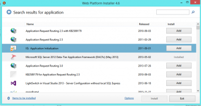
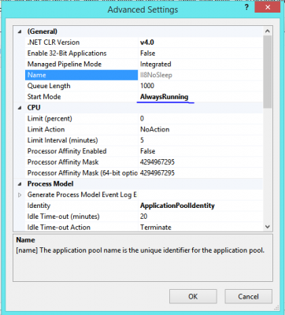

Since IIS 8, application pool has an advanced option that allow to never sleep. Instead of being active on demand, which boot up the application pool only when someone call the website. This is problematic for performance because the first person to hit the website as a booting time that can be several seconds if not minutes. Even with the configuration that indicate to not recycle the application pool, this has the problem of the first start-up. Also, having the application pool to never reset is not a good practice. In fact, it is a good practice to reset the application pool in a schedule where your website is not in a big time window. For example, if you do not have a lot of visit at 2 am, you can specify to recycle at 2am. Still, before IIS 8.0, this was possible but the first person to hit the website will pay the price. Before going any further, you need to have installed the Application Initialization module. It is free and available by the Web Platform. A link is available if you select inside IIS the root node of your server.



With IIS 7.5 and after, it is possible to select the **Start Mode**. The Start mode can be "On Demand" or "Always Running". "On demand" starts the application pool from a HTTP request. "Always running" uses the Windows Process Activation Service (WAS) to start the application pool. This was available with IIS 7.5 but IIS 8.0 does have this configuration within IIS without having to modify any applicationhost.config file. It is more convenient. 



To enable the preloaded, a modification to the machine configuration is required. IIS 8 does not have any screen that allow you to enable it. The file is located here : `C:\\Windows\\System32\\inetsrv\\config\\applicationHost`.config 

```xml 
<sites> <site name="Default Web Site" id="1"> <application path="/"> <virtualDirectory path="/" physicalPath="%SystemDrive%\\inetpub\\wwwroot" /> </application> <application path="/TestToDelete" applicationPool="II8NoSleep" preloadEnabled="true"> <virtualDirectory path="/" physicalPath="C:\\inetpub\\wwwroot" /> </application> <bindings> <binding protocol="http" bindingInformation="*:80:" /> </bindings> </site> 
```

 The line 6 of the previous XML is the one you want. In fact, you need to search for you site which is under the sites XML element. Then, you see the application path that need to be modified. The "preloadedEnabled=true" is the attribute to add. This file needs to be edited with administration privileges.

At this point, any time the application pool is recycled, this one will boot it to be available.

But, since it send a fake request to your website to boot up, would it be great if you could choose which page that the WAS use? Yes and it can be configurable. This a must if you have a page that load data into the cache or to wake up manually other resources. To customize the page to be called by IIS, you need to open the web.config of your website and add a XML element. 

```xml
 <applicationInitialization remapManagedRequestsTo="Startup.htm" skipManagedModules="true" > <add initializationPage="/default.aspx" /> </applicationInitialization> 
```

The XML has a remapManagedRequestsTo which is the page to be displayed when the loading is executed. Instead of having blank screen with a long loading progress bar, this allow to display a static message to the visitor. The initializationPage is the page to be called by the WAS.
