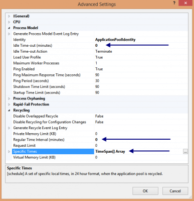

It is important to have not only a good code but to have this one into a hosting environment that will make it looks good. One negative point that we hear with IIS is that when the application pool sleep, the user that do a query have a penalty of time on its first query. This can lead to several second of waiting. It is interesting to note that since at least 5 years that we can have IIS to auto start. It is also interesting to note that we can also make IIS not to become idle.

## Changing IIS Idle Time

The first step to improve IIS performance is to remove the time out. This can be done by opening IIS, open the **Application Pool** you want to change the setting and to open the Advanced Setting Window. The window has a Process Model section where you will find **Idle Time-out (minutes)** setting. You can set this property to 0. By default, the Application Pool also recycle every few minutes. You can set it to 0 to have this one not recycle. This will cause a higher availability of IIS during the day where most client are. If your application have low period, let say that you are building for an internal website for a company, you can set a absolute time to recycle. This can be set in the same screen as before, the Advanced Setting of the Application Pool, by changing the Specific Times. For example, we can set to recycle the pool at 1 am every day.



## Auto Start

The auto start functionality is something that allow you to do an action when IIS start your application pool. For example, you could load in your caching system information from your database. You can also do some code that verify the availability of external webservice, etc. This require some manual editing of file on the server where reside your IIS. The file that needs to be edited is named **applicationHost.config** and it is located in the system folder : c:\\windows\\system32\\inetsrv\\config\\.

The first section that you need to edit is the one that has your application pool name. You must ensure that you have **autoStart = true** and the **startmode** to **alwaysrunning**. 

```xml
 <add name="YourAppPoolName" autoStart="true" startMode="AlwaysRunning" managedRuntimeVersion="v4.0"> <processModel identityType="SpecificUser" userName="DefaultAppUserName" idleTimeout="00:00:00" /> </add> 
```


In the same file, the second section to find is the application path. You can find this section by searching your application name. You must have **serviceAutoStartEnabled=true** and to set a **serviceAutoStartProvider** to an unique name that we will define soon. 

```xml
 <application path="/YourApplicationPath" applicationPool="YourAppPoolName" serviceAutoStartEnabled="true" serviceAutoStartProvider="YourProvider" > <virtualDirectory path="/" physicalPath="C:\\inetpub\\wwwroot\\YourApplicationPath" /> </application> 
```


The provider name we just set needs to be defined. This can be done by adding a new section (if this one is not yet there) in the applicationHost.config file (same file that we are currently modifing the XML) under the section **serviceAutoStartProviders**. 

```xml
 <serviceAutoStartProviders> <add name="YourProvider" type="YourProvider, Full.NameSpace.To.YourProvider, version=1.0.0.0, Culture=neutral" /> </serviceAutoStartProviders> 
```


IIS will get the DLL from your application bin folder and start running your custom code for your application when the application pool boot.

The last part is to code the custom code of your provider. This can be done by implementing a specific interface. This interface has a PreLoad method that is executed by IIS. The interface that you must implement is named **IProcessHostPreloadClient**.


```csharp
 public class YourProvider : IProcessHostPreloadClient { public void Preload(string[] parameters) { } } 
```

Do not forget that this feature is available only for IIS 7.5 and above. Also, do not forget that you may have to do some additional code if you want to use your repository with your IoC container. If you are using the Http Cache that Asp.Net provides, you need to have the namespace added to your project that has the custom provider.
