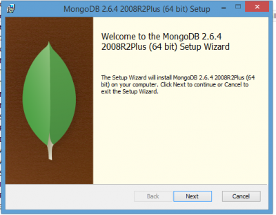
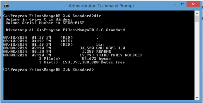
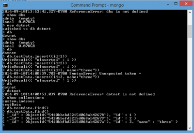

The first step is to install MongoDB on your machine. You can go on the official website, in the top menu, you will see Download. Click the Download link (http://www.mongodb.org/downloads) and then select the Windows version. You can download the 64 bits or 32 bits. In this tutorial of MongoDB we will use the **MongoDB 64 bits for Windows**. The file is about 132 megs and is a setup.



The installation is pretty straight forward. You can select the typical installation to have a basic setup. During the installation, you will have to accept to elevate the permission.

From here, it is time to open a Command Prompt with administration right. Let's go in the folder we just installed MongoDB. Since we have installed the typical package with the 64 bits version, the installation should be in **program file**.



You can after that configure MongoDB. The next steps are taken directly from MongoDB documentation. You must create a directory to save the content. This can be anywhere so let's do a data folder at the root of the installation path. The md command let you create a directory. The code below is what you can write to create the default path that MongoDB uses. ``` 
 cd "C:\\Program Files\\MongoDB 2.6 Standard" md \\data\\db 
``` 

Then, you can start MongoDB. ``` 
 cd bin mongo.exe 
``` 

Me, the first time I start MongoDB I got a warning followed by an error saying that it was not possible to connect.

> C:\\Program Files\\MongoDB 2.6 Standard\\bin>mongo.exe MongoDB shell version: 2.6.4 connecting to: test 2014-09-10T13:34:40.878-0700 warning: Failed to connect to 127.0.0.1:27017, reason: errno:10061 No connection could be made because the target machine actively refused it. 2014-09-10T13:34:40.882-0700 Error: couldn't connect to server 127.0.0.1:27017 (127.0.0.1), connection attempt failed at src/mongo/shell/mongo.js:146 exception: connect failed

Than I realized that I was launching **mongo.exe** instead of **mongod.exe**. Once the administration console lunch the mongod.exe you can start a new console (no need to have administration privileges on this one) and start mongo.exe. Here is what you should see.


Do not forget to specify the **--dbpath** when starting the **mongod.exe** because otherwise it will store everything on you **c:\** drive.

## Basic Commands

Here is few commands that may be useful during the development. **dbs shows** the database you have ``` 
 show dbs 
```  You can create new database or switch the a database by using the **use** command. ``` 
 use mydb 
```  Information are added into collection. You can add data into a collection with the command **db..insert()**. Here is an example of three insert into a collection named "testdata" of the dotnet database.

``` 
 use dotnet db.testdata.insert({id:1}) db.testdata.insert({id:2}) db.testdata.insert({id:3,name:"three"}) 
```  It is possible to see if the collection of the active database really exist with **show collections** command.

``` 
 show collections 
``` 

The last command that is really useful is to see the content of a collection. You can use the **find()** command. ``` 
 db.testdata.find() 
```  Keep in mind that if you see nothing it might be because you typed the collection name with the wrong case sensitivity. MongoDB is case sensitive. Here is screenshot of the output of all commands that we just discussed. 
