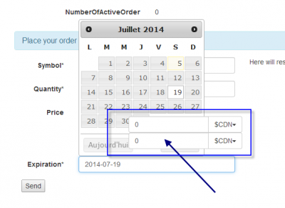
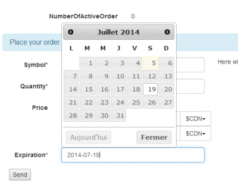

BootStrap has a class named **input-group** that allows you to have a input box with a button, before or after. The problem is that it set all inputs with a z-index to 2. JQuery Calendar is bound to control, like input box. If you have multiple rows of input, and if one of them is bound to JQuery Calendar, the result is having a calendar behind a text box.

To fix this issue, we need to set JQuery Calendar over the z-index, over 2. This is a rare occasion where the !important keyword is mandatory.

[css] /\*Fix a bug with BootStrap that set input within input-group with a z-order to 2. This make the JQuery Calendar to appear behind the input box\*/ .ui-datepicker{ z-index: 3 !important;} [/css]

There is not need to have the z-index with a huge value.

The fix is simple and short and was easy to find. The trick was to check with any browser developer tool and verify the div of the calendar to figure out the z-index.
