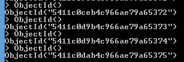

Recently I have been working with MongoDB. Here is some highlight that might help you to take the decision to use that No-Sql database.

In MongoDB, write operations are atomic at the **document level**. If you design your data to use reference (which is possible) forget about atomic transaction. Also, if you design by referencing other document, it will not be possible to get the information with a single query.

It is possible to query MongoDB with operator such as comparing with $gt, $gte, $lt, $lte, $in, $nin, $ne. Logical operation exist with $or, $and, $not, $not. Others type of operator exists and can be used for querying the database or to project. Here are some example.

```typescript
db.users.insert({name:"patrick", age:30}) db.users.insert({name:"mélodie", age:26}) db.users.insert({name:"vincent", age:30}) db.users.insert({name:"julie", age:28}) db.users.find({age:{$lt:30}}) // Return 2 elements 
``` 


When you document get over **16 megs**, Mongo divide it into part. The need of GridFS is than required to reassemble every part of the document.

In MongoDB you can allow the system to generate the unique identifier by not setting any \_id. But, you can also take the liberty to assign the \_id when inserting your document.

It is better to store one to many reference into the "one side". This way, you do not have a huge array in the "many side". You can also reference something that does not exist yet. For example, if A reference B, you can insert A with a reference to B and then insert B.

It is possible to set index, like in SQL, to improve performance. This can be done with the **ensureIndex** method. This method is available on the database. ```typescript
db.users.ensureIndex({name:1}) 
``` 


It is possible to store in a string information such as a hiearchical path and then query against that string property with a regex to find.

It is possible to write with the MongoDb command **insert**, **update**, **findAndModify** and **remove**.

The update command can be executed against a collection. This one has three parameters. The first one is the query. You can specify the unique identifier of the data your want to update or to any other criteria. This can be useful for embedded resource to query multiple documents that has the same embedded information. The second parameter is what we are updating. We can update the whole document or a part of it. It is also possible to push ($push) information into an existing array or to increment/decrement value of a field. The following example come from the MongoDB website and it update a book by its ID only if this one has available book on the shelve. It update by decreasing the number of available copies and push a new entry about who checkout the book. This is all done atomicly.

```typescript
db.books.update ( { \_id: 123, available: { $gt: 0 } }, { $inc: { available: -1 }, $push: { checkout: { by: "abc", date: new Date() } } } ) 
``` 


Doing operations like update, insert, delete return some information into a WriteResult object. Some properties like the number of found element by the query, the number of inserted or modified document are returned. The number of inserted can be above 0 when updating if in the third parameter of the update you specify the option of inserting if not found.

When defining an index on an array, MongoDB creates index entries for each element. This mean that if you have a document with an index on an array of 3 elements that in the backend the information will be set in three index collection. For example, if you have a car document with an array of color and that you set an index on the color array the document will be indexed 3 times and also stored one time as the car itself. This has an impact in the inserting time (like in SQL).

If you are working with money and want to be exact, you need to multiply your number to have an integer. For example, storing 9.99 with a precision of 2 decimals would require you to store 999 in MongoDB. By then, you have to divide by 100 to get back the real value. Depending of the precision you want, you multiply and divide by the power of 10 desired.

The primary key is defined with MongoDB ObjectId. This ObjectId is generated by using the Unix TimeStamp, the machine identifier, the process id and a random value. It's result look like a GUID. You can generate one by calling **ObjectId()** 
