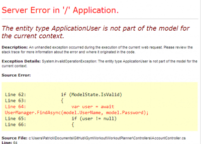

If you are using Asp.net Identity (OWIN authentification framework) with a custom user schema you may stumble into an error that you model is not part of the context.

> The entity type ApplicationUser is not part of the model for the current context.



This exception is raised if you go to the login screen and try to log in. It occurs if you have a DbContext class that inherit directly to DbContext and not of IdentityDbContext.

Your database context must be aware of Identity tables.


```csharp
 public class DatabaseContext :IdentityDbContext<ApplicationUser> 
```

Having this inheritance solve the problem.
