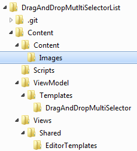
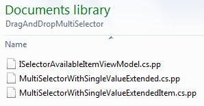
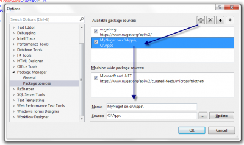

This is a tutorial about how to create your first Nuget package. 

## Part 1 : Setupping basic information of Nuget

The first step is to get Nuget.exe. This is required to create the Nuget package but also to create the first draft of the meta data of the package. It's open source and can be found at [CodePlex](http://nuget.codeplex.com/).

The second step is to create the meta data package. This is where you specify the name of the application, the version of the Nuget and others information. Another very important section of the meta data is the dependencies list. It allows you the specify other package name and version that needs to be installed before installing your package. To get a brand new meta data file, open a Windows console and type .

``` 
 nuget spec 
``` 

This will create a new file like the following one. 
```xml
 <?xml version="1.0"?> <package > <metadata> <id>Package</id> <version>1.0.0</version> <authors>Patrick</authors> <owners>Patrick</owners> <licenseUrl>http://LICENSE_URL_HERE_OR_DELETE_THIS_LINE</licenseUrl> <projectUrl>http://PROJECT_URL_HERE_OR_DELETE_THIS_LINE</projectUrl> <iconUrl>http://ICON_URL_HERE_OR_DELETE_THIS_LINE</iconUrl> <requireLicenseAcceptance>false</requireLicenseAcceptance> <description>Package description</description> <releaseNotes>Summary of changes made in this release of the package.</releaseNotes> <copyright>Copyright 2013</copyright> <tags>Tag1 Tag2</tags> <dependencies> <dependency id="SampleDependency" version="1.0" /> </dependencies> </metadata> </package> 
```


For my example, it was to transform the [open source project](https://github.com/MrDesjardins/DragAndDropWebList) that I have published few weeks ago. What I want to transform is the part that is a MVC template. Here is my transformed file. 
```xml
 <?xml version="1.0"?> <package > <metadata> <id>DragAndDropMultiSelectorList</id> <version>1.0.0</version> <authors>Patrick</authors> <owners>Patrick</owners> <projectUrl>https://github.com/MrDesjardins/DragAndDropMultiSelectorList</projectUrl> <iconUrl>https://raw.github.com/MrDesjardins/DragAndDropMultiSelectorList/master/iconNuget.png</iconUrl> <requireLicenseAcceptance>false</requireLicenseAcceptance> <description>This nuget package installs the Javascript, the CSS and the Templates to allow to have UIHint to have special control to drag and drop items from an available list of item to a selected list.</description> <releaseNotes>First version</releaseNotes> <copyright>Copyright 2013</copyright> <tags>drag-and-drop </tags> <dependencies> <dependency id="jQuery" version="2.0.3" /> <dependency id="jQuery.UI.Combined" version="1.10.3" /> </dependencies> </metadata> </package> 
```


You can also use this open source project, the [Nuget Explorer](http://nuget.codeplex.com/), that allow you to edit every meta data properties. It also allow you to publish directly to Nuget once you have an account and a API key.

## Part 2 : The content of the Nuget package

The next part is the content of the Nuget package. Create a folder with the name "content". Everything in this folder will be moved to the solution. This mean if you have inside the folder "content" a folder "Content" and inside this one you have "Images" and you set a file "forward.png" that when the Nuget package is installer, the image will be set at this position. For my example, here is the file structure.



The second step of this part is to have some pre-processing. Nuget allows to change part of every file dynamically. This can be done if you rename your file by adding .pp at the end. For example, I want to use the user namespace for 3 files. I change these three files extension and open them to add the namespace tag.




```csharp
 namespace $rootnamespace$.ViewModel.Templates.DragAndDropMultiSelector { public interface ISelectorAvailableItemViewModel<TUniqueIdentifierType, TExtendedValueType> { TUniqueIdentifierType ID { get; set; } string Description { get; set; } TExtendedValueType ExtendedProperty { get; set; } } } 
``` As you can see the first line contain $rootnamespace$ which will dynamically change the namespace to the user namespace.

The last step of this part is to add a web.config.transform file to add configuration in the web.config if required. In my scenario, nothing was required so I haven't added it.

## Part 3 : Publish the Nuget package

When everything is setup, it's time to create the Nuget package. This can be done by using the nuget.exe previously downloaded. You need to execute the .nuspec created by the first step. ``` 
 nuget pack C:\\Users\\Patrick\\Documents\\GitHub\\DragAndDropMutltiSelectorList\\DragAndDropMutltiSelectorList.nuspec 
```  This will create a file called DragAndDropMutltiSelectorList.1.0.0.nupkg (of course it will be your Nuget name and version). This can be published to Nuget's website or your own Nuget repository. To do a fast test, open Visual Studio and add a local folder that has your new Nuget package. This way, you will be able to install any local Nuget package inside this folder. To do, go to _Manage Nuget Packages For Solution_ that is located under Tools>Library Package Manager. Then, click Setting at the bottom of the screen. This will popup the option window for Nuget. Here, you can add your folder.



If you double click your package, it will be installed. This allow you to test your package before publishing it on the web. But, once it's tested, you can publish it on Nuget.org. This step is very fast. You need to create an account, then you upload the .nukg and that's it. You can find the package that I just created at this url now : https://www.nuget.org/packages/DragAndDropMultiSelectorList/
