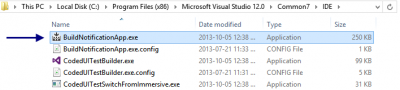
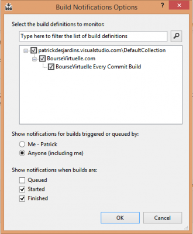
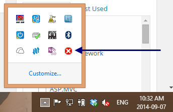

Visual Studio comes with multiple interesting tools. One of the tool is the **Build Notification** application.

This tool can be located in the Common7\\IDE folder. Here is an example with Visual Studio 2013:

C:\\Program Files (x86)\\Microsoft Visual Studio 12.0\\Common7\\IDE\\BuildNotificationApp.exe

Once open, you have to configure the tool to let its know what build to check.

Here is an example that has been automatically filled up since I am already using Visual Studio and TFS for project.

When the configuration is set, the system tray will show an icon with the status of the last build. For example, here is the icon when build fail. 

This tool is quite handy if you have a team that is using TFS and when you are using the build server. This way, you can know exactly when the build fail and be ready to react.
