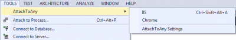
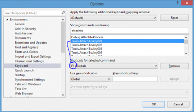

Developing web application require at some point to use IIS. Visual Studio lets you debug easily with IIS Express by pressing F5. This one start Visual Studio Express and attach automatically Visual Studio debugger to the IIS Express process. However, if you are using IIS, nothing is automatic. You have to go in the **Debug** menu, select **Attach to Process** and than in the list select **w3wp.exe**. This is something that you can do something more than a dozen a time per day.

Today, I found something interesting in the Visual Studio Extension Gallery. It is an [extension](http://visualstudiogallery.msdn.microsoft.com/81677d17-6e81-4f14-87cc-4ccee2fd2589) that let you do that with a single click.

Since this extension is adding in the menu the action, it is possible to assign a shortcut to the action. IIS is assigne to the 1 _attach to item_.

I have assigned mine to the F1 key. Every time that I want to debug, I just need to hit F1 and I am ready to go.
