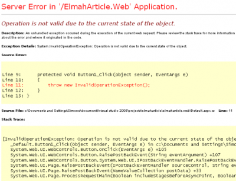

If you are using Asp.Net MVC, your should have a BaseController that every controllers of your project inherit. In this base controller, your should have override the method OnException.


```csharp
 protected override void OnException(ExceptionContext filterContext) { //1) Write log here //2) Redirect from the yellow screen of death to a custom nice error page } 
```

At least, this is what it should have. The step one as nothing to do with the **ExceptionContext.HttpContext.IsCustomErrorEnabled**. The second step, yes. In fact, when you are developing the yellow screen is very informative. 

This is why it can be interested to not


```csharp
 protected override void OnException(ExceptionContext filterContext) { if (filterContext.HttpContext.IsCustomErrorEnabled) { filterContext.ExceptionHandled = true; this.View("YourErrorPage").ExecuteResult(this.ControllerContext); } } 
```

**IsCustomErrorEnabled** is true when in the web.config the **customerror** is set to true. It's false when it's set to false. When the value is set to remoteonly, it's true when executing on localhost (127.0.0.1) and false when not. It's possible to use this variable with the IsCustomErrorEnabled and to leverage of it inside your base controller.

To answer the question, when to use IsCustomErrorEnabled with Asp.Net MVC
