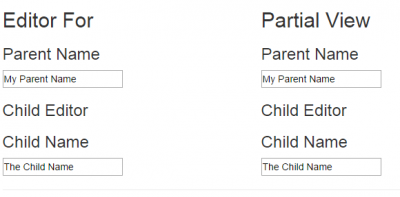

I have entitle this article with `EditorFor` vs `PartialView` because it is the scenario where the difference matter the most. `DisplayFor` produces the same Html output but does not affect that much the end result because the data is not sent back to the server. This lead us to the main question about what is the difference between using Template, like `EditorFor`, instead of `Partial View`. In both case, we want to achieve the same thing, to display an input control that will allow to send the user input to the server. To help the understanding of the difference between the two, let's create two classes that are going to be used. Both of them will contains a string to be inputted by a text box. One class will have a property to the second class. This way, we have a child object. This is where the difference make an impact.


```csharp
 public class Child { public string ChildName { get; set; } } public class Parent { public string ParentName { get; set; } public Child SingleChild { get; set; } } 
```

This is as simple as it can be. Next, we need to create a controller that will call the view with the _Parent_ model. We choose the _Parent_ class because this one contains the inner class.


```csharp
 public ActionResult Index() { var parentModel = new Parent(); parentModel.ParentName = "My Parent Name"; parentModel.SingleChild = new Child {ChildName = "The Child Name"}; return View(parentModel); } 
```

The last step is to create a view that is using both rendering technical choice. The first one is with templates (EditorFor) and the second is with Partial Views.


```csharp
 @model TemplateVsPartialView.Models.Parent <div class="row"> <div class="col-sm-6"> <h2>Editor For</h2> @Html.EditorFor(d=>d) </div> <div class="col-sm-6"> <h2>Partial View</h2> @Html.Partial("_parentPartialView", Model) </div> </div> 
```

The output looks like the same but the source code generated is different. Here is a screenshot of the Html output. 



Here is the Html markup. We can see a difference in the name and the id of the input for the child name. The reason is that the partial view does not know about where the model is used. This is a major drawback when you need to send back everything to the server because the html query string name does not contain the property name of the child class. This mean that is cannot bind the information to the inner class.

```html
<div class="row"> <div class="col-sm-6"> <h2>Editor For</h2> <h3>Parent Name</h3> <input id="ParentName" name="ParentName" type="text" value="My Parent Name" /> <h3>Child Editor</h3> <h3>Child Name</h3> <input id="SingleChild_ChildName" name="SingleChild.ChildName" type="text" value="The Child Name" /> </div> <div class="col-sm-6"> <h2>Partial View</h2> <h3>Parent Name</h3> <input id="ParentName" name="ParentName" type="text" value="My Parent Name" /> <h3>Child Editor</h3> <h3>Child Name</h3> <input id="ChildName" name="ChildName" type="text" value="The Child Name" /> </div> </div> 
``` 

Here is the code for the editor for and for the partials. 

```csharp
 //parent.cshtml 
 @model TemplateVsPartialView.Models.Parent <h3>Parent Name</h3> @Html.TextBoxFor(d=>d.ParentName) <h3>Child Editor</h3> @Html.EditorFor(d=>d.SingleChild)

//child.cshtml
 @model TemplateVsPartialView.Models.Child <h3>Child Name</h3> @Html.TextBoxFor(d => d.ChildName)

//parent partial view (_parentPartialView.cshtml) 
@model TemplateVsPartialView.Models.Parent <h3>Parent Name</h3> @Html.TextBoxFor(d => d.ParentName) <h3>Child Editor</h3> @Html.Partial("_childPartialView", Model.SingleChild)

//child partial view (_childPartialView.cshtml)
 @model TemplateVsPartialView.Models.Child <h3>Child Name</h3> @Html.TextBoxFor(d => d.ChildName) 
```

As you can notice, the editor for and the partial view is the same code. The only change concern the first call from the view. The view uses for one the `EditorFor` Html helper while the second use the `Partial View` Html helper. Another difference concerns where the templates are located and where the template view are located. The templates can be closer to the view inside `EditorTemplates`/`DisplayTemplates` folder or can be shared across the application with `Shared` folder. This is also true for partial view where they can be in a Shared folder at the root of the Views folder or directly under the controller folder with all views of the controller.

You can find the source code in [GitHub](https://github.com/MrDesjardins/TemplateVsPartialView/) or download the [Zip](https://github.com/MrDesjardins/TemplateVsPartialView/archive/master.zip).
