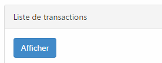

If you are using Bootstrap library and are using the button to load something from Ajax you may want to have the button to be disable and display a waiting message. The easiest way to do is to use the button with the **data-loading-text** attribute. This allow to use the button method to have the text in the attribute to be placed inside your button and once it is done to call again the button method to have the text reset back to the original value.


```html  <button id="buttonSelector" class="btn btn-primary" data-loading-text="... Loading ..."> Do long action here</button> 
```  The JavaScript: ```typescript
$("#buttonSelector").click(function () { $(this).button('loading'); // Long waiting operation here $(this).button('reset'); } ); 
``` 


So far, the text is changing but their is not animation. A trick is to use a glyphicon, available with Bootstrapper, and to make this one animate with CSS3. The first modification is to set the **data-loading-text** attribute with the glyphicon code. This mean that we will set html into the attribute. 
```html  <button id="buttonSelector" class="btn btn-primary" data-loading-text="<span class='glyphicon-left glyphicon glyphicon-refresh spinning'></span>... Loading ..."> Do long action here</button> 
```  The JavaScript remains the same but a new addition is required in the CSS. 
```css
 .glyphicon.spinning { animation: spin 1s infinite linear; -webkit-animation: spin2 1s infinite linear; }

@keyframes spin { from { transform: scale(1) rotate(0deg);} to { transform: scale(1) rotate(360deg);} }

@-webkit-keyframes spin2 { from { -webkit-transform: rotate(0deg);} to { -webkit-transform: rotate(360deg);} }

.glyphicon-left { margin-right: 7px; } 
```


The animation is 1 second long and is linear which mean that during the 1 second the animation will remain constant. The spin animation is a transform on the rotation from 0 degree to 360 degree which is a complete rotation. Here is the end result.


