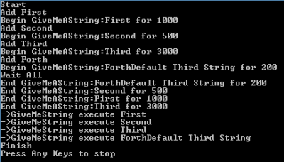
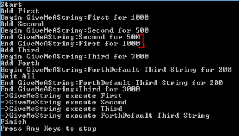
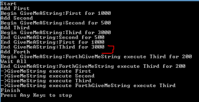

**Async** is a keyword that has been introduced since some time in the .Net framework. It got more popular with C# 5.0, about 4 years ago and recently, during the last year, we can see default templates using **Async** almost everywhere. **Async** is useful to have threads that are not waiting for nothing. The concept of asynchronous allows you to have multiple operations simultaneously. What make the **async** keywords powerful is that you do not have to play with callbacks and thread -- the framework handles everything for you. Asynchronous code is very interesting when you have network requests, disk accesses or tasks that process for a long time. Async frees up the thread that is executing the task, which allows to framework to reuse it for something else. The framework optimizes the resources and give an easy way to do parallelism in your code without affecting too much your design. However, as you will note by using the **async** keyword, this one must be spread from the first call to the end. You will not be able to use half asynchronous code with half synchronous code -- or not asynchronous.

Let's start a Console application to do something simple. Doing a console application is interesting because Console applications are not async. They start in a single process - in a single thread. This is the nature of the console to do sequential tasks. Creating a new Web Api project or a new Web project with the latest framework, would have been more natural because Asp.Net framework include all async from the reception of the request and beyond. Therefore, let's take the hard way to understand more what is going on. First, two keywords must be used : **await** and **async**. Second, by convention, method that are async must be prefixed by "Async" string. For example, we are going to create an async method that write into the console a string and wait few milliseconds to simulate an intensive I/O (input / output) task. Since we are going to make it **async**, it will be named with its name followed by "Async" : _GiveMeAStringAsync_.


```csharp
 private static async Task<string> GiveMeAStringAsync(string suffixe, int millisecondTaskTake) { Console.WriteLine("Begin GiveMeAString:" + suffixe + " for " + millisecondTaskTake); await Task.Delay(millisecondTaskTake); Console.WriteLine("End GiveMeAString:" + suffixe + " for " + millisecondTaskTake); return "GiveMeString execute " + suffixe; } 
```

The method is like any other method but as before the return type the keyword **async**. The second difference is the return type. In a nutshell, the return type must be of type **Task** or its generic version **Task**. It can be also **void** for the case of "fire-and-forget". In that latest case, we will never get any news about the task. Most of the time, we should not return **void** and we want to handle the answer from the task. The task is a king of bookmark that will tell the to thread some information about the task that it must execute. Any async method return a task that is automatically returned, without any delay until this one is awaited. In the code posted above this paragraph, we have a **Task.Delay** method that return a **Task**. We could have set the return of this method into a Task object.


```csharp
 var myTask = Task.Delay(millisecondTaskTake); //Do something else here await myTask; 
``` As you can see, dividing the task into a variable allows you to do something else without executing the whole concrete task, in this example, the delay. When the task, _myTask_, hits the await keyword, this one wait the completion of the task. In the example, the delay. Let's see a more complete example that use our async method. 
```csharp
 var allStrings = new List<Task<string>>(); Console.WriteLine("Start"); Console.WriteLine("Add First"); allStrings.Add(GiveMeAStringAsync("First", 1000)); Console.WriteLine("Add Second"); allStrings.Add(GiveMeAStringAsync("Second", 500));

Console.WriteLine("Add Third"); allStrings.Add(GiveMeAStringAsync("Third", 3000)); string thirdTask = "Default Third String"; //thirdTask = await allStrings.Last(); Console.WriteLine("Add Forth"); allStrings.Add(GiveMeAStringAsync("Forth" + thirdTask, 200));

Console.WriteLine("Wait All"); var task = allStrings.ToList(); var allAwaitedTask = await Task.WhenAll(task); foreach (var s in allAwaitedTask) { Console.WriteLine("->" + s); } Console.WriteLine("Finish"); 
```

This code is huge but cover a lot of interesting scenarios. First, we create a collection of Task. This mean that we expect multiple methods that will return a string. This could have been your own class. It does not need to be a primitive type. In the example, I put several _Console.WriteLine_ to display in the console to order of the code. Then, I am adding to the collection a first method with a delay of 1 second, following by a second with a delay of half a second, a third one of 3 seconds and the last one with 200 milliseconds. They are all added to the list and are executed. The execution takes the time specified in the parameter because they are delayed by the method that simulate I/O tasks -- with the use of _Task.Delay_. After adding all the tasks, and executing them, I have used the method **Task.WhenAll(listOfTaskHere)**. This indicate to the thread to wait every tasks to be completed before continuing. We do it because we want to display the result of each of these methods. 


```csharp
 var allStrings = new List<Task<string>>(); Console.WriteLine("Start"); Console.WriteLine("Add First"); allStrings.Add(GiveMeAStringAsync("First", 1000)); Console.WriteLine("Add Second"); allStrings.Add(GiveMeAStringAsync("Second", 500)); Thread.Sleep(5000); Console.WriteLine("Add Third"); allStrings.Add(GiveMeAStringAsync("Third", 3000)); string thirdTask = "Default Third String"; //thirdTask = await allStrings.Last(); Console.WriteLine("Add Forth"); allStrings.Add(GiveMeAStringAsync("Forth" + thirdTask, 200));

Console.WriteLine("Wait All"); var task = allStrings.ToList(); var allAwaitedTask = await Task.WhenAll(task); foreach (var s in allAwaitedTask) { Console.WriteLine("->" + s); } Console.WriteLine("Finish"); 
``` 

Another example would be that a task depends on a previous task. For example, let's make the forth task use the third one result. That mean that the third task must be completed before the forth one to allow the forth task to use the result of the third one. 
```csharp
 var allStrings = new List<Task<string>>(); Console.WriteLine("Start"); Console.WriteLine("Add First"); allStrings.Add(GiveMeAStringAsync("First", 1000)); Console.WriteLine("Add Second"); allStrings.Add(GiveMeAStringAsync("Second", 500)); //Thread.Sleep(5000); Console.WriteLine("Add Third"); allStrings.Add(GiveMeAStringAsync("Third", 3000)); string thirdTask = "Default Third String"; thirdTask = await allStrings.Last(); //We are awaiting the third task here to use the string into the forth's task Console.WriteLine("Add Forth"); allStrings.Add(GiveMeAStringAsync("Forth" + thirdTask, 200));

Console.WriteLine("Wait All"); var task = allStrings.ToList(); var allAwaitedTask = await Task.WhenAll(task); foreach (var s in allAwaitedTask) { Console.WriteLine("->" + s); } Console.WriteLine("Finish"); 
``` To make the forth task use the result of the third task, we need to **await** the third task before the call of the forth's one.

If you want to try this into a console by copy-pasting the code in this article, you will get into some problem. The reason is as stated at the beginning, console does not support async code. We need to create from the console a async task that will handle all the async code. This can be done by using **Task.Run(async()=>{/*You code here*/});** That mean that we would do: 
```csharp
 static void Main(string[] args) {

Task.Run(async() => { var allStrings = new List<Task<string>>(); Console.WriteLine("Start"); Console.WriteLine("Add First"); allStrings.Add(GiveMeAStringAsync("First", 1000)); Console.WriteLine("Add Second"); allStrings.Add(GiveMeAStringAsync("Second", 500)); //Thread.Sleep(5000); Console.WriteLine("Add Third"); allStrings.Add(GiveMeAStringAsync("Third", 3000)); string thirdTask = "Default Third String"; thirdTask = await allStrings.Last(); Console.WriteLine("Add Forth"); allStrings.Add(GiveMeAStringAsync("Forth" + thirdTask, 200));

Console.WriteLine("Wait All"); var task = allStrings.ToList(); var allAwaitedTask = await Task.WhenAll(task); foreach (var s in allAwaitedTask) { Console.WriteLine("->" + s); } Console.WriteLine("Finish");

}).Wait(); Console.WriteLine("Press Any Keys to stop"); Console.ReadLine(); }

private static async Task<string> GiveMeAStringAsync(string suffixe, int millisecondTaskTake) { Console.WriteLine("Begin GiveMeAString:" + suffixe +" for " + millisecondTaskTake);

await Task.Delay(millisecondTaskTake);

Console.WriteLine("End GiveMeAString:" + suffixe + " for " + millisecondTaskTake); return "GiveMeString execute " + suffixe; } 
```

**Async** works with **await**. Every time a code calls an asynchronous method, the code is executed until it reaches a task that is **await**. When the code is awaited, the thread is released and the flow continues on the caller code until it reaches another await call. In the example, every time we were calling the _GiveMeAStringAsync_ method, the console was writting that it begins and then wait. From this wait, the code was going back to the caller -- the Main method -- and continue its way until it reaches and other await. This is why we were able to see all "Begin GiveMeAString" message at the beginning because the code was never stopping until it reaches the **Task.WhenAll** which was also in an await but this time was the last because it was running into a Task.Run with a Wait. Programming with asynchronous requires a new mind set. It is not easy, and I am not used to work this way too. Since the first 10 years with .Net we had to work in a more sequential ways or to use thread to create parallelism. Now, the syntax is clean, the superfluous of handling threads is abstracted with the await and async keyword. Working with async improves the resource of your system and is something that must be considered more and more in the future of high depend website and service to lower your cost and increase the performance of your system.

You can find this code on GitHub : [https://github.com/MrDesjardins/AsyncTaskExperience](https://github.com/MrDesjardins/AsyncTaskExperience)
