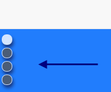
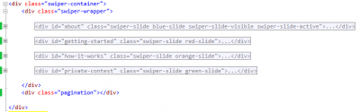

The front page of your site must contains all the information to allow the user to do an action. In the creation of a web application, the front page must states clearly what the application is doing, give some highlight of the benefits of the application, displays images and videos. You can have multiple pages to shows all different topics or you can have a long scrollable page. This article explains how to create a long scrolling page.

An important aspect of long scrolling page is to still have a good user experience. That mean to have inner page navigation, being able to scroll with the mouse wheel but also from the scroll bar. These days, it is also important to be mobile compatible which mean that it must be swippable.

The first step is to download some libraries. Here is a list of libraries used in this tutorial.

Jquery

[Swiper](http://www.idangero.us/swiper/)

[Stellar](http://markdalgleish.com/projects/stellar.js/)

**JQuery** is there because I am already using the library and is useful in some part of this process. Mostly because we will associate **Swiper** and **Stellar** with JQuery to Html elements. Swiper is used as a pillar in this one page scenario. The reason is that it is the JavaScript library that transform the default web browser into a Power Point presentation. The Stellar library is used to improve the experience by adding the parallax effect when scrolling from top to bottom and the other way around. Let's start with the JavaScript configuration and then the Html. Keep in mind that some decisions are based on specific choices that are custom to the website I am creating -- mostly optional in a default case.

```typescript
var mySwiper = new Swiper('.swiper-container', { pagination: '.pagination', paginationClickable: true, mode: 'vertical', speed: 1000, mousewheelControl: true, onSlideChangeStart: function(swiper) { var slideIndex = swiper.activeIndex; $('#pagination-nav li').removeClass("active"); $('#pagination-nav li:eq(' + slideIndex + ')').addClass("active"); }, hashNav: true, grabCursor: true }); 
``` 
 The creation of the Swiper object takes an element to be used for the Power Point container. In that case, I specify a class that will be used. It could have been an unique Id too. The second parameter is for settings. The first one is optional and allow to have an automatic pagination which is represented by little dot. One dot per Html's slide, the active one will be with a different dot color. The next image show you what it creates for you. Indeed, you can configure the visual representation of the pagination the way you want with CSS.




```css
 /*Little dot for the navigation. This must always be there above all slides */ .pagination { position: absolute; z-index: 20; left: 10px; top: 40px; }

/*Every page has a little switch at the top left corner*/ .swiper-pagination-switch { display: block; width: 18px; height: 18px; border-radius: 8px; background: #555; margin: 0 0px 5px; opacity: 0.8; border: 1px solid #fff; cursor: pointer; box-shadow: 2px 5px 7px rgb(23, 38, 95); }

/*The selected slide has a switch of a different color*/ .swiper-active-switch { background: #fff; } 
```


The css code here is the one for the switches. I decided to have mine fix at the top of the screen with vertical alignment since I am scrolling vertically with Swiper. The direction is set inside the Json's setting with also the speed between slide. I strongly suggest to set something between 500ms and 1500ms. Smaller does not look good with the parallax effect and too slow make it non usable for your user. The event about slide starting to change is for an optional behavior. This project has in this page a sticky menu that is using BootStrap and I wanted to make change the current tab. The event remove all class that specify the active slide and set the current one. The CSS takes care of highlighting the correct one.


Next inside of the Swiper JavaScript code, in the document ready, we can set the Stellar code. ```typescript
var property = 'transform'; $('.swiper-wrapper').stellar({ scrollProperty: property, positionProperty: property, horizontalScrolling: false }); 
``` 


The **Stellar** library code is pretty short and works with the Html with a specific data attribute. You must select the parent container that contains all slides. The JavaScript will loops through all html element and will apply some parallax effect on all elements with the **data-stellar-ratio**.



Every sections Html code looks as follow: 
```html  <div id="about" class="swiper-slide blue-slide swiper-slide-visible swiper-slide-active"> <article class="container all-information-from-slide"> <div class="row"> <header class="col-md-6 col-md-push-6"> <h1>@Index.AboutMenu<span class="smaller" data-stellar-ratio="1.3">@UI.WebSiteTitle</span></h1> <h2 data-stellar-ratio="1.2">@Index.AboutSlideSubTitle</h2> </header> <div class="slide1-image slide-image" data-stellar-ratio="1.9" >  </div> <div class="slide1-image-shadow slide-image-shadow" data-stellar-ratio="1.7">  </div> </div> <div class="container row"> <section class="entry-content row" data-stellar-ratio="1.1"> <p class="col-md-6 col-md-push-6">@Index.AboutSlideDescription</p> </section> <a class="next-slide-button" data-stellar-ratio="1.2"><i class="fa fa-arrow-circle-down fa-5"></i></a> </div> </article> </div> 
```  The slide must have an unique identifier and the class _swiper-slide_. Everything inside is really custom. I am using the _container_ class, _row_ class and _col_ class just because I am using **BootStrapper** inside the slide to align my text. The data attribute for Stellar allows to have different speeds between Html elements. The Id is also important because inside the Swipe setting, we specify the use of hasNav which is a custom plugin that I have modified a little. The default plugin change the browser Url with the hashtag of the tag (slide id). Instead of using just the hash tag, I make it use the bang-hash-tag. This way, we do not have weird scroll behavior with the library and still be able to give the url to anyone. Also, the Url is indexable by search engine! All-wins.


Here is the result of the first slide. You can see at the left the pagination with the little round switched. At the left is the image that is floating. I have set also an other image for the shadow under it. Both have different stellar ratio which create a nice effect. The right side contains different Html element, like headers and paragraphs. This way, we can set different ratio number and have everything float during scrolling in a different speed. For the full visual experience here is a short video.


