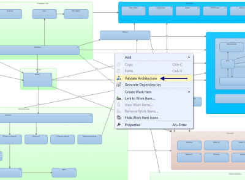
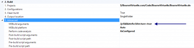

Visual Studio Ultimate edition has an architecture diagram that can be validated by right clicking the architecture. This is very interesting for project that become bigger and bigger to ensure that none of the developers by-pass layers or libraries in a way that is not intended.



The problem is that people tend not do validate the architecture for several reasons. The simplest one is that maybe not a lot of your developers has the Ultimate edition. Nevertheless, the good news is that Visual Studio Online lets you do what you can do locally with MsBuild. MsBuild with the argument /p:ValidateArchitecture=true will validate any architecture diagram you have.

``` 
 msbuild /p:ValidateArchitecture=true 
``` 

This can also be setup when building on the cloud. Open Visual Studio, go in the **Builds** tab from the **Team Explorer**. Edit any of your **build definition**, select **Process** and go under **Build** and **Advanced**. You can set from there MsBuild's arguments. Use the same argument that you are using locally : /p:ValidateArchitecture=true.



When the architecture is not respected, the build server will thrown an error saying the problem within the architecture layer/code. This is the best way to ensure a strong architecture on the long term.
