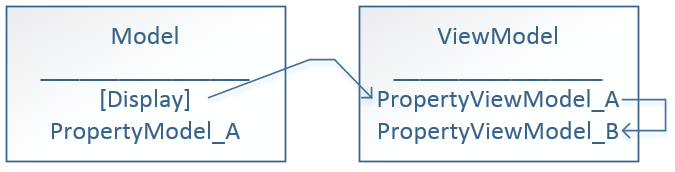

Earlier, I showed [how to transfer attribute form model class to view model class with AutoMapper and Asp.Net MVC](http://patrickdesjardins.com/blog/how-to-automap-asp-net-attribute-from-model-to-viewmodel). This work fine but what if the view model class has a custom property that manipulate even further the data and that you would like to display on screen a display attribute from another property of the model class? The solution we had in the previous post transferred the display attribute from the model to the view model’s property by using AutoMapper to map the DisplayAttribute with the corresponding From and To property. But how can we extends this logic to be able to pass this attribute to another property of the view model class? This is what we will resolve in this article. The following image illustratre the desired result. We want the property B from the view model to use the p roperty A display attribute that come from the model property A. 

The first part, is already been done in the AutoMap code from the previous article. This is the code that map the attribute from the model to view model. The next step is to specify in the view model that we need to transfer from one property’s attribute to the other property. This require to create a new attribute where we can specify from which property we want to get the attributes.


```csharp
 public class CopyAttributesFrom : Attribute { public string PropertyName { get; set; } } 
``` Then, we need to use it in the view model class. This class is limited to one property: the name of the property to take attributes. The mapping is than 1-1, nothing fancy. Let’s see an example. The following code is having two property. The first one get from the model some attributes and the second one want to get the attribute from the first property (which also has once mapped the ones from the model).


```csharp
 public TimeSpan? MinimumHoldingTime { get; set; }

[CopyAttributesFrom(PropertyName = "MinimumHoldingTime")] public int? MinimumHoldingTimeMinutes { get { return this.MinimumHoldingTime.HasValue ? Convert.ToInt32(this.MinimumHoldingTime.Value.TotalMinutes) : (int?)null; } } 
``` Why don’t we map directly into AutoMapper the logic? Because the code we are using to transfer attributes from the model to viewmodel works with **DestinationProperty** and not an expression. Having logic in the **ForMember** method of AutoMapper uses an expression. This force us to map the value and in a second step to have the property desired with the data manipulated.

In the code to map with AutoMapper model attributes to view model, we had a custom **DataAnnotationsModelMetadataProvider**. This one need to be adjusted to add attributes from our custom a _CopyAttributesFrom_ attribute.


```csharp
 public class MappedDataAnnotationsModelMetadataProvider : DataAnnotationsModelMetadataProvider { private readonly IConfigurationProvider mapper;

public MappedDataAnnotationsModelMetadataProvider(IConfigurationProvider mapper) { this.mapper = mapper; }

protected override ModelMetadata CreateMetadata(IEnumerable<Attribute> attributes, Type containerType, Func<object> modelAccessor, Type modelType, string propertyName) { //Copy attributes from the model and to the view model var mappedAttributes = containerType == null ? attributes.ToList() : mapper.GetMappedAttributes(containerType, propertyName, attributes).ToList();

//Map CopyAttributes attributes foreach (var attributeCopy in attributes.Where(d => d.GetType() == typeof (CopyAttributesFrom)).Cast<CopyAttributesFrom>()) { var propertyFromTheMappedModelOfTheCopiedProperty = mapper.GetMappedAttributes(containerType, attributeCopy.PropertyName, attributes).ToList(); mappedAttributes.AddRange(propertyFromTheMappedModelOfTheCopiedProperty); } var modelMetadata = base.CreateMetadata(mappedAttributes, containerType, modelAccessor, modelType, propertyName); return modelMetadata; } } 
```

The foreach is where everything happen. We verify that the property we map is marked with our copy attribute; if yes, we go in AutoMapper to get from the model the attributes. We must go back to the model and not directly copy the attributes from the specified viewmodel’s attribute because this one may not already been transferred from the model — we do not control the order that **CreateMetaData** is invoked. Nevertheless, this is not a problem, we take the view model property name, and instead of binding the attribute to the property specified we bind them to the property we are creating the metadata.

If you are not using this whole AutoMapper model/view model mapping, you can get a similar result by using the .Net framework. Here is how.


```csharp
 var sourceProperty = containerType.GetProperty(attributeCopy.PropertyName); var allAttributeFromSpecifiedProperty = sourceProperty.GetCustomAttributes(true); foreach (object attr in allAttributeFromSpecifiedProperty) { mappedAttributes.Add(attr as Attribute); } 
```

Nonetheless, this solution has a pitfall which is the way we specify the property to copy the attributes — this one is hardcoded. Refactoring of this class is harder and the string may be unsynchronize with a property rename. However, since we localize the copy to the class itself and not beyond this boundary, the instability is restrained. This is a limitation of the actual .Net framework which does not allow to use expression inside an attribute.
