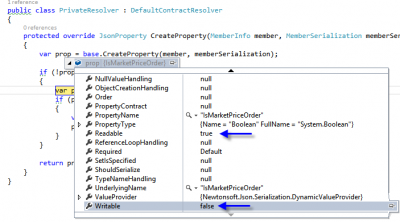

You may have a private constructor for your class. This is often useful if you want the developer to use a constructor but still have your ORM to be able to create your entity. The problem is when serializing and deserializing will use the public constructor and will pass null on every parameters. To have the deserializer user the private constructor, like the ORM, you need to tell Json.Net that it can use private constructor.


```csharp
 new JsonSerializerSettings { ConstructorHandling = ConstructorHandling.AllowNonPublicDefaultConstructor } 
```

The **JsonSerializerSettings** required is the **ConstructorHandling** which need to be set to **AllowNonPublicDefaultConstructor**.

Also, you may have public getter but private setter. Often the case when the property value must be set with private logic. However, when serializing and deserializing, these values will not be set. To allow Json.Net to use the private setter, you must set a new contract resolver.

Json.Net can have custom contract resolver. The trick is to tell to Json.Net that if the property has a private setter to use it.


```csharp
 new JsonSerializerSettings { ContractResolver = new PrivateResolver() } //......... public class PrivateResolver : DefaultContractResolver { protected override JsonProperty CreateProperty(MemberInfo member , MemberSerialization memberSerialization) { var prop = base.CreateProperty(member, memberSerialization);

if (!prop.Writable) { var property = member as PropertyInfo; if (property != null) { var hasPrivateSetter = property.GetSetMethod(true) != null; prop.Writable = hasPrivateSetter; } }

return prop; } } 
``` This is it. 
