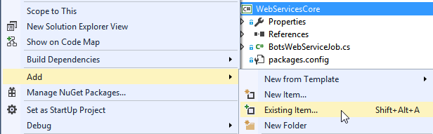
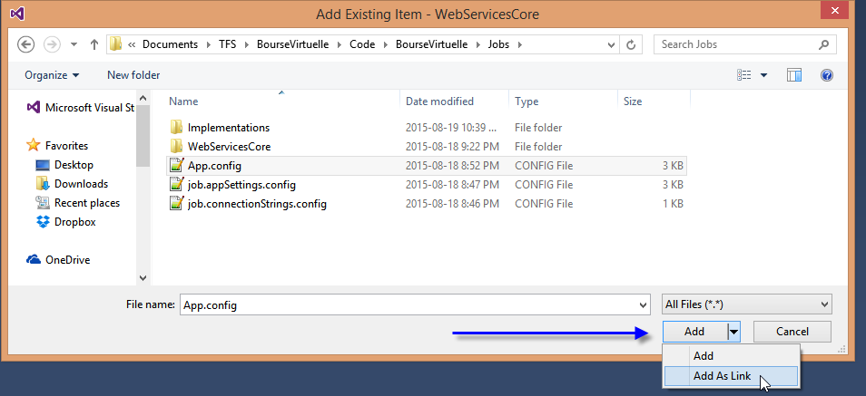
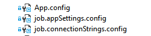

Instead of duplicating the same information over and over again in multiple projects you should use the same file. A typical scenario can be that you have 1 console project for each web job and you want them to have the same app.config that share the same AppSetting configurations and the same Connection Strings.

The trick is to have in a central place the app.config file and to add a existing item as a link instead of a link. This hidden feature combined with some file property allow you to have the single instance of AppSetting on every bin folder.

The first step, is to select the project where you want to use the shared file. There is some ways to do it. The simplest is to right click the project, select **Add** and **Existing Item**. 

The second step was unknown by me for many years. It's very hidden. In the Add Existing Item, the dialog allows you to select any type of file. Watch out for the file extension filter. Below the file extension drop down, you have a button which by default is set to Add. Once you have selected the AppSetting file, instead of clicking on **Add**, go in the dropdown and select **Add as Link**. This is an awkward experience because you must select the file first because this dropdown on value change trigger the action.

The last step is to go into the property of the link and to change the compilation behavior. The desired state is to have the app.config in your bin folder. Thus, you must change the file property to set the **Build Action** to **Content** and the **Copy to output** to **Copy if newer** (or always).

To wrap up, we have now in the solution explorer one file, or many depending of how many links you have setup. These links are not duplicated file, so if you are linking them from several projects editing anyone of the link will edit values for every one. This is very powerful and allows you to not repeat yourself. If you want to be sure that you have really added the file as a link, just check the solution explorer for the blue icon. 
