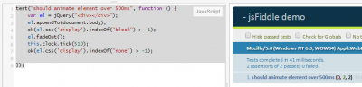

I wasn't unit testing much my client side code until I joined Microsoft. Most of the time to reason was the time and also that most of the web application I was working on did not require to have this degree of testing. Since I am working in a division that does not have testers we have to have a bigger coverage. In JavaScript, it is possible to hide html element with JQuery with fadeOut and make them reappears with fadeIn. Under the hood, it just do an animation that has the final result to have a style that display to none or to display block the control. Nevertheless, in some scenario you want to unit test if in a particular condition the html element is really there or not.

This can be done easily with [Qunit](https://qunitjs.com/) and [SinonJs](http://sinonjs.org/). Qunit is the JQuery JavaScript unit test framework and SinonJs is a mock/stub/fake library. For the purpose of this article, I will not explain how Qunit and SinonJs works but concentrate on the fact that you cannot simply invoke something that move in time and expect to assert right away. The reason is simple : the animation takes time to be completed.

```typescript
test("should animate element over 500ms", function () { var el = jQuery("<div></div>"); el.appendTo(document.body); ok(el.css('display').indexOf("block") > -1); el.fadeOut(); ok(el.css('display').indexOf("none") > -1); }); 
``` 


This test fail on the second assertion. The reason is that _fadeOut_ is not yet done and we are already asserting the display which is still to _block_. We need to play with the time. We need to fake the time to something in the future. This is where SinonJs come to the rescue.

```javascript
test("should animate element over 500ms", function () { var el = jQuery("<div></div>"); el.appendTo(document.body); ok(el.css('display').indexOf("block") > -1); el.fadeOut(); this.clock.tick(510); ok(el.css('display').indexOf("none") > -1); }); 
``` 




It is possible to add some tick to the testing framework. To do so, use the clock property and use the tick function. The parameter takes the time in millisecond you want to move forward. If you check the Date of the browser, you will notice that this has a direct impact of the date time. You can call that method as many time you need. In the example, I have used 510 milliseconds because the default fadeOut method takes 500 ms. The end result is that this unit test pass. You can see that demo working on that [JSFiddle](http://jsfiddle.net/7910ewrL/).

This way to unit test fadeIn and fadeOut works with any kind of JQuery animation and also any code that require some time in JavaScript. You can use it if you are using JQuery UI libary too.
