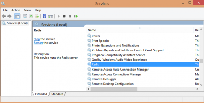
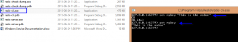
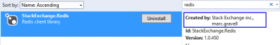

I have been using Memcached for the last decade and wanted to try **Redis** on a new project. Redis is also a cache system that allow you to cache data in the ram memory for fast access, like Memcached. Redis offers the same key-value experiences. Redis is newer and is having more functionalities. Where Memcached can be limited, for example in the choice of eviction strategies, Redis will offer several solutions. Memcached is also more restrictive concerning the key's size whilst Redis is way less. Redis offers the possibility of not be restricted to string for value but can use the Redis Hash system. It is also possible to do operation, like SQL, on the server side instead of having to retrieve the data to manipulate it. The goal of this article is not to sell you Redis but the tell you how to use it with C# and an Asp.Net MVC project.

The first thing to do is to install Redis on your machine. It is created for Linux but has a simple installation for Windows. In fact, Microsoft has a open source implementation where you can download the installation from this [GitHub page](https://github.com/MSOpenTech/redis/releases). I hear a lot of good feedback about it. Most say that Microsoft try not to inject any Microsoft's flavor into it and keep it just as in implementation from the Linux ones -- which is great. I also believe that this will be keep up-to-date since Microsoft offers a Redis service in part of Azure. Once you download the file and install, you will have a running service in your machine.



Once it's running, you can do a quick test with the Redis-cli console. You can set and get a value with a simple **set** and **get** command. 

Next step, is to be able to set and get from the Asp.Net C# application. This is where it can be tricky. There is multiple clients available. Do not waste your time with the servicestack one. Even if a lot of documentation is available, that library became not free since version 4. The version 3 is still available to download via Nuget but it's more than 1 year old, the documentation does not fit quite well with the version 4 and it requires a lot of tricky hack to make everything work with all dependency packages. After wasted 3 hours I decided to use the stackexchange version one. The name is similar so do not get confuse.



Once installed, you'll be able to access Redis with almost no effort for basic command like setting and getting. Here is a short example of possible use.


```csharp
 public class RedisCache : ICache { private readonly ConnectionMultiplexer redisConnections;

public RedisCache() { this.redisConnections = ConnectionMultiplexer.Connect("localhost"); } public void Set<T>(string key, T objectToCache) where T : class { var db = this.redisConnections.GetDatabase(); db.StringSet(key, JsonConvert.SerializeObject(objectToCache , Formatting.Indented , new JsonSerializerSettings { ReferenceLoopHandling = ReferenceLoopHandling.Serialize, PreserveReferencesHandling = PreserveReferencesHandling.Objects })); }

public T Get<T>(string key) where T :class { var db = this.redisConnections.GetDatabase(); var redisObject = db.StringGet(key); if (redisObject.HasValue) { return JsonConvert.DeserializeObject<T>(redisObject , new JsonSerializerSettings { ReferenceLoopHandling = ReferenceLoopHandling.Serialize, PreserveReferencesHandling = PreserveReferencesHandling.Objects }); } else { return (T)null; } } 
```

From here, you can inject the ICache with your IOC and use RedisCache. You can get and set any object. Voila! Of course, this class is not ready for any production code. The real ICache should have more methods like deleting and you should not hardcode "localhost", but this should give you enough to get started with Redis and .Net.
