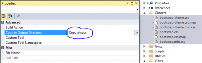

You created your brand new web application with Nancy (MVC Katana for Microsoft OWIN) and you want to use BootStrap. Nuget is working like all .Net project so you can get BootStrap. However, every time one of your page want to get BootStrap's stylesheet you have this one routed into your NancyModule. This is wrong because Nancy default behavior is to not route any file from the **content** folder. The problem is that Nuget added BootStrap in the content folder BUT has not set the property to copy the file when compiling. The reaction of Nancy is that it cannot find the file, so it try to route it.

To fix this issue of not having BootStrap or any other **content** file routed, right click the files inside the **content** folder and click **properties**. Choose from the C**opy To Output Directory** the option named **Copy Always**. Recompile your application, launch the web project and you should be all fine.

