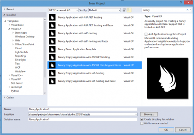

Here is the context. Imagine that you have to host a web content in someone computer that does not have IIS. How can you do it? It exists multiple solutions from Node.js server to having a JavaScript only solution. However, if you have a lot of code already done in .Net and want to reuse that code, something else exist. In fact, what the solution exist since few years. Microsoft has the project **Katana** with the goal of removing hard dependencies on different web modules like we have with Asp, Asp.Net Web Form and Asp.Net MVC. An open standard called Owin emerged from that project. **Owin** means **Open Web Interface for .Net**. It goals is to create new components that can be easily developed and consumed but also create applications that could be more easily ported between hosts and potentially entire platforms/operating systems.

In this article, I will show you how to start with Owin to host inside a console a web server. We will use Nancy to be able to render Asp.Net MVC and use Signalr to have some real time update. The project will be very simple so you will not see the full potential but you will be able to do few things like displaying a razor page (.cshtml), use static resource like images for some images in a specific folder and handles all others with your code, get a real time notification when a client connect to the system and be able to notify from the server to the client content with Signalr.



First of all, we need to create a solution with a project. One way to do it is to start with Nancy template. You can search for Nancy in Visual Studio and choose a template. Let's choose "Nancy Empty Application with ASP.NET hosting and Razor". This will come with some references that we will change but it will give us some of the stuff to work with. First thing to do is to remove the Nancy.Hosting.Aspnet. The reason is that Nancy come with its own self hosting environment, based on Owin but we want to use the generic one. The reason is that we will not only use Nancy but Signalr. So we will use the Owin bootstrap and attach in the pipeline Nancy and Signalr. We can uninstall with the Package Manager Console: 

``` 
 Uninstall-Package Nancy.Hosting.Aspnet 
``` 

Then, let's install some packages. First, the Owin host (generic one). Second, SignalR core library and the JS one that allow the view to connect to the backend. Third, we need to use the Razor View engin of Nancy. This differ a little bit from Asp.Net MVC Razor. We cannot use the Asp one because it has dependencies on the Asp stack. Forth, is the Cors package that allow us to do cross-domain call. This is required by SignalR. 

``` 
 Install-Package Microsoft.Owin.Host.SystemWeb 
 Install-Package Microsoft.Owin.Hosting 
 Install-Package Microsoft.AspNet.SignalR.Owin 
 Install-Package Microsoft.AspNet.SignalR.JS 
 Install-Package Nancy.Viewengines.Razor 
 Install-Package Microsoft.Owin.Cors 
``` 

Before continuing, be sure that you are targeting the latest .Net Framework. I have set mine to 4.5.2, 4.5.1 works too but 4.0 fail on some packages. Also, verify that you have the latest package for all Owin libraries. You can get a list of the package that are not updated with that commands: ``` 
 Get-Package -updates 
``` 

The next step is to create the console that will host the process. Keep in mind that you could create a Windows Service too or any other kind of container to host your Owin solution.


```csharp
 class Program { static void Main(string[] args) { var url = "http://+:8080";

using (WebApp.Start<Startup>(url)) { Console.WriteLine("Running on {0}", url); Console.WriteLine("Press enter to exit"); Console.ReadLine(); } } } 
```

This code start the web application host at the post 8080. You can use what ever port you want. The important information is the line with **WebApp.Start**. It takes a type of startup project. This is the core of the configuration about what we are going to host. In our case, we will host for **Nancy** and **Signalr**. Here is the configuration class.


```csharp
 public class Startup { public void Configuration(IAppBuilder app) { app .Map("/signalr", map => {

map.UseCors(CorsOptions.AllowAll); var hubConfiguration = new HubConfiguration(); map.RunSignalR(hubConfiguration); }) .UseNancy(); } } 
``` Two important configuration. The first one is Signalr that allow to use Cors (cross origin references) and the second is Nancy. It is important to notice that SignalR has been defined first. This is because in the request pipeline, we want Signalr to be the first to verify if it can handle the request, and then Nancy. The reason is that in the application I am doing, I want to catch all URL and do something with them. I do not want to catch specify SignalR calls.

Nancy requires to have a bootstrapper class. 
```csharp
 public class Bootstrapper : DefaultNancyBootstrapper { protected override void ConfigureConventions(NancyConventions nancyConventions) { base.ConfigureConventions(nancyConventions); nancyConventions.StaticContentsConventions.Add(StaticContentConventionBuilder.AddDirectory("Scripts")); } } 
```

If you define a class that inherit from DefaultNancyBootstrapper, the system will use it. Here we can define a directory that Nancy will not handle request from. This is how to say to Nancy to do not take care of the JavaScript requests. By default, Nancy does not handle static files from the Content folder. However, for the Scripts folder, you must add this one with the StaticContentsConventions.

It is important to note that Nancy will catch all extensions. See the web.config file. You should see that by default, the HttpHandler configured use all path. If you open the web.config and this is not the case, you should add these two configurations. This will allow you to handle every call. For example, 

``` 
 http://localhost:8080/your/path/to/action or http://localhost:8080/your/path/to/action/test.png but not http://localhost:8080/content/image.png or http://localhost:8080/scripts/jquery.js 
```

```xml
 <system.web> 
  <httpHandlers> <add verb="*" type="Nancy.Hosting.Aspnet.NancyHttpRequestHandler" path="*" /> 
  </httpHandlers> 
</system.web> 
<system.webServer> 
  <handlers> 
    <add verb="*" type="Nancy.Hosting.Aspnet.NancyHttpRequestHandler" path="*" /> 
  </handlers> 
</system.webServer> 
```


The next thing to do is to define Nancy's modules. This is like defining Asp.Net Mvc routing in the same time of defining your Asp.Net Controller.


```csharp
public class IndexModule : NancyModule { 
  public IndexModule() {

    Get[@"/{uri*}"] = parameters => { 
      var regex = new Regex(@"\\.(png|gif|jpg|jpeg)$"); 
      if (regex.IsMatch(parameters.uri)) { 
        return View["image"]; 
      } 
      else { 
        return View["content"]; 
      } 
    }; 
    Get["/"] = parameters => { 
      return View["index"];
     }; 
  } 
} 
``` 
Every routes has a priorities depending of the routing syntax used and order. In that case, I want to handle every images (which are not in the content folder, remember!) and also all other routes that will be for content. I also define a second route for the main web page. This is a case of using Owin/Nancy to handle images. Let's say that you have some logic for dynamic image or for image that are not on the server but somewhere else. This way you can have your Http Image Handler withing your code.

The next step is to enable Signalr. This is to add the capability to the server and webpage to communicate. The code will not do a lot of thing here but in fact can update the content in real time. First, in the backend you need to create a class that inherit from Hub. 
```csharp
public class ExchangeHub : Hub { public void Init(string urlHere) { Console.WriteLine(urlHere); }

public void SendDataToClients(string data) { Clients.All.UpdateContent(data); } } 
```

This will generate by default some JavaScript code to all the client to call the server. The Init function all to send from the client side a string to the server. What we will do is when the page finish to load to call the server. The server can after that use the SendDataToClients to send some data back the the client.

The JavaScript file that need to be inserted inside your cshtml file should look this way: 

```html
<script src="Scripts/jquery-2.1.1.js"></script> <script src="Scripts/jquery.signalR-2.1.2.js"></script> 
<script src="http://localhost:8080/signalr/hubs"></script> 
<script type="text/javascript"> $(document).ready(function () { 
  //Set the hubs URL for the connection $.connection.hub.url = "http://localhost:8080/signalr";

// Declare a proxy to reference the hub. 
var chat = $.connection.exchangeHub;

// Create a function that the hub can call to broadcast messages. 
chat.client.UpdateContent = function (data) { alert(data); };

// Start the connection. 
$.connection.hub.start().done(function () {

  // Call the Send method on the hub. 
  chat.server.init("url here");

  }); 
}); 
</script> 
``` 


First, we need to define in that specific order three scripts. 
The first one is JQuery, the second one is Signalr and the third one is the Signalr hub that has been automatically generated. 
After, we connect to the server hub and we get the exchangehub that come from the proxy file generated and we setup what happen when the server call the update content. 
In this example, we just alert the message. Finally, we send a request to the server when the page is finally loaded and that the hub is ready (connection is established between client and server). 
You can find the source code into this [Git repository](https://github.com/MrDesjardins/NancySelfHostedWithSignalR).
