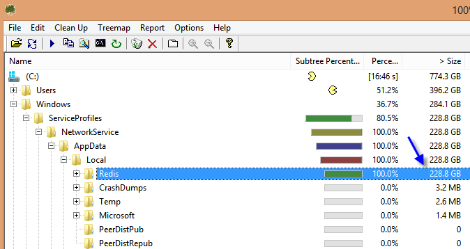

I noticed my hard drive losing space faster than usually. I decided to run a tool named "WinDirStat" which is free and allow to get a portrait of your hard drive. Within few seconds, the culprit was inside Windows folder, to be more accurate: **C:\\Windows\\ServiceProfiles\\NetworkService\\AppData\\Local\\Redis**.

I am running Redis as a service on my machine since about 2 months and never realized that this one store the size of the ram of your machine in multiple files. Each files are named with "RedisQFork_9076.dat" and the number vary. Each of them were 8 gigs because I had a 8 gig ram machine.

This only occur on 64bits OS, otherwise it is cap limited to 500 megs. So why does these files are created? Because Redis was created to be on Linux first. The Windows version needs to mimic some behaviors. Redis clusters, backup, synchronization needs to use the fork command that Windows OS does not have. So, it uses the file system.

To clean up, you need to go to C:\\Windows\\ServiceProfiles\\NetworkService\\AppData\\Local\\Redis but before deleting anything, you must stop the Windows service named "Redis". Then, you can delete all files from that folder and start again the service.

If you want to move these files into another directory, this is possible with the latest Windows Redis version. Go in the configuration file of Redis located: **C:\\Program Files\\Redis\\redis.windows-service.conf**. Search for **heapdir**. It's also possible to limit the size by changing the setting named **maxheap**.
