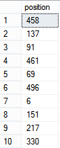

While seeding a database you may want to do a quick change at your value. The fastest way to have new value which are not all the same is to randomize update or insert value in your SQL table. You can use 3 SQL methods to achieve this insertion of random value. The first is the **rand** method. This method generate a float number between 0 an 1. If you are using this method you will have the same value when updating a bulk of values. The reason is the the seed remain the same for all updates. To have unique value generated on each updates you must provide a new seed to the cast method. This is where the second method is required, the **checksum** method which from unique string give you a unique number to seed. To have a unique number you use the third method called **NewId**. This one generate a unique Guid. Finally, you can use the **cast** method if you want to have an integer.


```sql
 update YourTableName set YourColumnName = cast(rand(CHECKSUM(NEWID())) \* 500 as int) where Id = '9308cbb9-f079-4456-9bb8-d1de88367aaa' 
```


From there, you can play with the fact that you receive a value between 0 an 1. For example, if you want to have a range of 0 to 500 you just need to multiply by 500. If you want to have value between 100 and 500 than you need to multiply by 400 and add 100.


