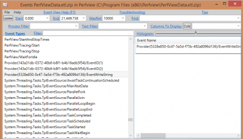
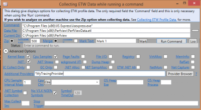
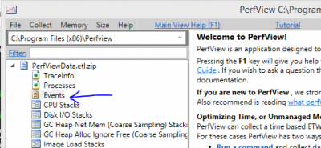

Tracing information can be done in multiple ways. You can use the Diagnostic framework, use Microsoft Enterprise Library or Log4Net. However, if you need to trace performance information, Event Tracing for Windows (ETW) is the way to go. The reason is the Event Tracing for Windows (ETW) is build to receive stream of information and to manage, with Windows, the most efficient way to not reduce the performance of your system. It always get information on the whole system which can be better to figure out why something is getting slower if it impacted by something outside your application.

Since .Net Framework 4.5, ETW is way easier to setup and to use. However, keep in mind that it is not as sweet as it could be. ETW's tools are old and not easy to understand. This is why, I suggest that you go see those [Channel9 Videos on PerfView](http://channel9.msdn.com/series/PerfView-tutorial "PerfView Channel9"). PerfView is the tool to read the log created by ETW. When you application is using ETW, this one is sending log to the system. However, if this one does not capture it, nothing is saved. Therefore, that has the advantage to quickly start gathering information just by opening a listener, like PerfView.

Before going into PerfView, you need to setup your code to add specific events. Otherwise, you will capture every systems and application events but none of yours. With .Net Framework 4.5 and above, you need to create a class that inherit from **System.Diagnostics.Tracing.EventSource**. That say, you need to have a reference to System.Diagnostic. This one is available for Asp.Net VNext. You need to add the **Diagnostic** reference into the **project.json** of your project.

``` 
{ "frameworks": { "aspnet50": { "dependencies": { "Microsoft.AspNet.Diagnostics": "1.0.0-beta1" } }, "aspnetcore50": { "dependencies": { "System.Runtime": "4.0.20-beta-22231" } } } } 
``` 

The class that you create and that inherit from **EventSource** must have an attribute of type **EventSource** that define the name of the **Provider**. Then, you need to create one method for every event you want to capture. Every method needs to have an atribute of type **Event**. This define the message to be recorded. Here is an example.


```csharp
 [EventSource(Name = "MyTracingProvider")] public sealed class MyTracingProviderEventSource : EventSource { [Event(1, Message = "Method '{1}' begin", Level = EventLevel.Informational)] public void MethodCallBegin(string methodName) { if (this.IsEnabled()) { WriteEvent(1, methodName); } } } 
```

What is important here is that the method you define must has only primitive parameter. This is not only true for the **WriteEvent** method used to pass information to the event message but also to the method name. Passing a collection of one of your class and transforming this array into string within the method before passing the produced string to WriteEvent will not work. In fact, the result will be in PerfView under a Guid instead of your event name with the exception message that it cannot read. Here is an output 
``` 
 ThreadID="25,652" FormattedMessage="ERROR: Exception during construction of EventSource MyTracingProvider: Unsupported type IEnumerable`1 in event source. " DataLength="230" 
``` 
 

By the time you have created all events you want to capture, you should have downloaded PerfView. It is a free tool to capture and read all traces. If you are using Asp.Net VNext, you can start your application -- PerfView works with IISExpress. Then, in the main menu, select **Collect** and **Run**. In the command area, enter the path of IISExpress. Mine was installed in the x86 folder ("C:\\Program Files (x86)\\IIS Express\\iisexpress.exe"). 



To conclude, ETW is a great way to capture performance tracing. Windows Azure is compatible with this mechanism and you can use Windows Azure Storage Table to get information from your website. It is also a powerful tool to get insight of what is going on and to get some additional metric of your system without polluting the rest of your logs. You can find the additional information on the [Msdn Blog](http://blogs.msdn.com/b/vancem/archive/2012/08/13/windows-high-speed-logging-etw-in-c-net-using-system-diagnostics-tracing-eventsource.aspx) about why ETW is considered to be the ideal solution for high speed logging. Their is also a [tutorial from Msdn Blog](http://blogs.msdn.com/b/vancem/archive/2012/07/09/logging-your-own-etw-events-in-c-system-diagnostics-tracing-eventsource.aspx) about ETW. Some resources are also available on [Azure Website about how to read ETW log](http://azure.microsoft.com/blog/2014/11/12/announcing-azure-sdk-2-5-for-net-and-visual-studio-2015-preview/) with Asp.Net VNext and Visual Studio 2015.
